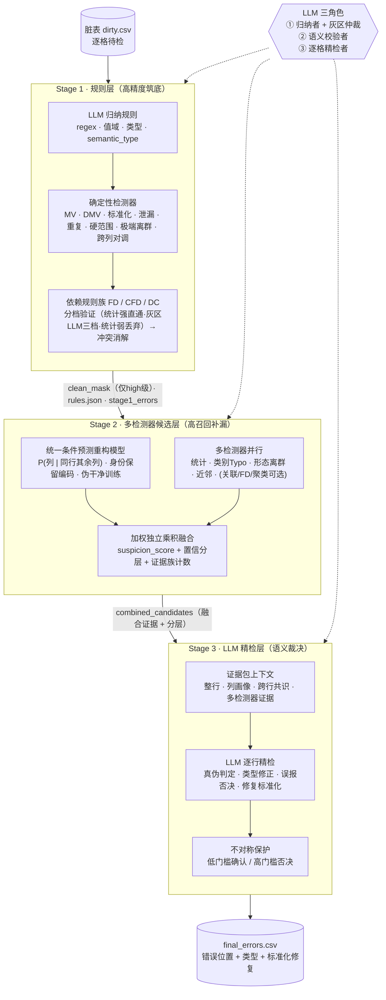
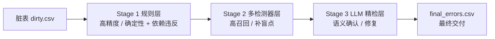
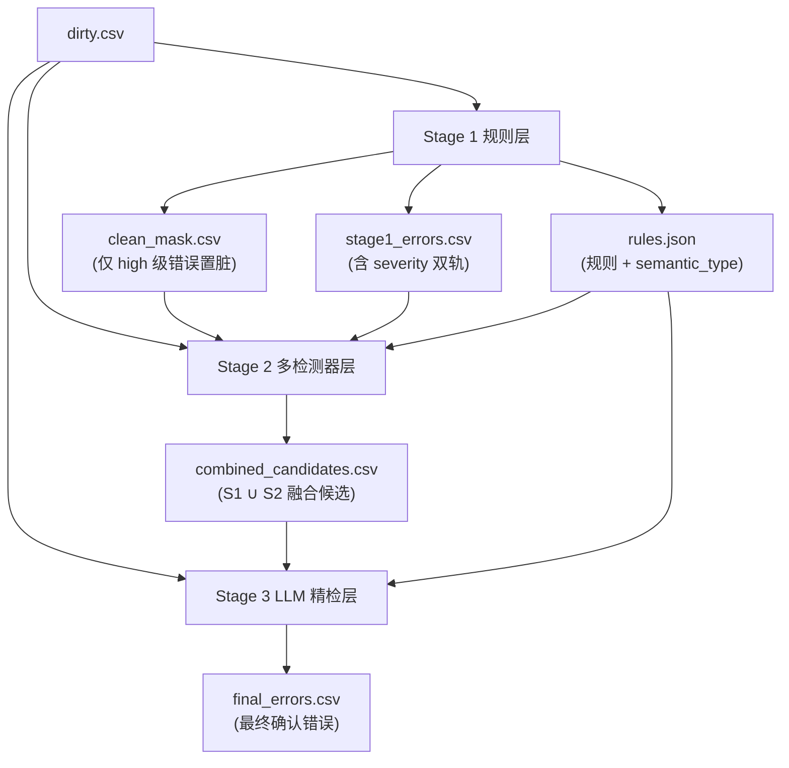

# 基于大语言模型的漏斗式错误检测框架概述

本文档概述本项目提出的**基于大语言模型（LLM）的漏斗式表格数据错误检测框架**。
框架将「规则筑底 → 多检测器补漏 → 语义精检」组织为一条逐层收敛的漏斗式流水线，在保证精度的同时提升召回，并借助 LLM 完成规则归纳、语义校验与逐格修复。

---

## 1. 框架总览

下图为框架的**整体设计鸟瞰**：脏表自上而下经三层漏斗逐层收敛（精度 → 召回 → 语义），每层以标准化产物向下传递知识；LLM 贯穿全程但只做归纳/校验/裁决，**确定性错误始终不被其单方面推翻**。



一句话概括：**规则层筑底求精 → 检测器层补漏求全 → LLM 精检层降误报保召回**，三者以 `clean_mask / rules.json / combined_candidates` 串成闭环，最终交付带位置、类型与修复建议的错误清单。

### 1.1 任务定义

给定一张脏表 `data/{dataset}_dirty.csv`，逐单元格判定其是否为错误，并给出：

- **错误位置**：`row_id`、`column`
- **错误类型**：`MV / DMV / FI / T / VAD / DIST / OTHER / NONE`
- **证据与分数**：`reason / anomaly_score / suspicion_score / confidence_tier`
- **修复建议**：`suggested_fix`（含来源 `fix_source` 与置信度 `fix_confidence`）

评估时以 `data/{dataset}_clean.csv` 与脏表逐格差异作为 ground truth。

### 1.2 错误类型体系

| 代码 | 含义 | 主要负责阶段 |
|------|------|--------------|
| `MV` | 缺失值 | Stage 1 |
| `DMV` | 伪缺失值（`?`、`unknown` 等占位） | Stage 1 |
| `FI` | 格式 / 类型 / 结构不一致 | Stage 1 / Stage 2 |
| `T` | 拼写错误（Typo） | Stage 2 |
| `VAD` | 值域 / 跨列依赖 / 共识违反 | Stage 1 规则族（FD/CFD/DC）+ Stage 2 |
| `DIST` | 分布 / 上下文异常 | Stage 2 |
| `OTHER` | 其他语义错误 | Stage 3 归类 |
| `NONE` | 精检后判定为非错误（误报） | Stage 3 |

### 1.3 漏斗三层分工

框架的核心思想是**精度—召回—语义逐层收敛**：每一层解决上一层难以覆盖的问题，并把可靠知识向下传递。

- **Stage 1 规则层**：高精度、可解释，优先检出确定性错误与依赖违反，为整体筑底
- **Stage 2 多检测器候选层**：高召回，补 Stage 1 的盲点，输出带证据的融合候选
- **Stage 3 LLM 精检层**：语义确认、过滤误报、统一错误类型与修复建议，产出最终交付结果



### 1.4 LLM 在框架中的三种角色

LLM 贯穿三层，但每层承担不同职责，且**始终不直接决定确定性错误的最终去留**：

- **Stage 1（归纳者 + 灰区仲裁者）**：为每列归纳可执行的校验规则与标准化规格，交由确定性代码执行；并对**统计灰区的依赖规则**做三档审核（high/medium/drop）
- **Stage 2（语义校验者）**：对统计挖掘出的函数依赖、列对调等候选做语义确认，过滤伪关系
- **Stage 3（精检者）**：基于结构化证据包逐格判定真伪、修正类型并给出标准化修复

### 1.5 阶段间知识传递

漏斗各层并非孤立运行，而是通过标准化产物传递知识，形成一条完整的数据流：



关键传递物：

- **`clean_mask.csv`**：Stage 1 标记的「未被判错」单元格掩码。仅 `severity==high`（高可信确定性错误）的单元格置为 `False`，`medium` 级弱证据（如统计灰区未获强确认的近似 FD）不进 mask，避免用「从脏数据挖出、易过报的规则」污染 Stage 2 训练分布
- **`rules.json`**：每列规则与 `semantic_type`、语义备注，为 Stage 2/3 提供列语义先验
- **`combined_candidates.csv`**：Stage 1∪Stage 2 融合后的候选，携带 `suspicion_score`、`confidence_tier`、`detectors`、`families/family_count`、多检测器证据与候选修复，供 Stage 3 消费

### 1.6 运行方式

各阶段可独立运行，也可用一键流水线脚本串联：

```powershell
# 分阶段（必须按序）
python main.py --input data/hospital_dirty.csv                          # Stage 1
python -m stage_2.cli --input data/hospital_dirty.csv [--all-detectors] # Stage 2
python -m stage_3.cli --input data/hospital_dirty.csv [--min-tier mid]  # Stage 3

# 一键流水线：Stage1->2->3 + 计时 + LLM token 统计 + 评估摘要
python run_pipeline.py --input data/hospital_dirty.csv
python run_pipeline.py --input data/hospital_dirty.csv --backup --backup-tag deepseek
python run_pipeline.py --input data/hospital_dirty.csv --fresh-cache
```

- 路径统一由 `paths/layout.py` 按 `{dataset}` 推导（`data/` 放原始数据，生成物写入 `output/mask|stage1|stage2|stage3/`，缓存写入 `cache/`）
- `run_pipeline.py` 产出 `output/runs/{dataset}_{run_id}_report.json`（计时 + token + 评估摘要）与 `_llm_usage.json`；`--backup` 时归档跑前产物到 `output/archive/`
- LLM 配置经 `.env`（`LLM_API_KEY / LLM_BASE_URL / LLM_MODEL`）注入，兼容 OpenAI 接口，可切换服务商

---

## 2. Stage 1：规则层

### 2.1 输入输出

- **输入**：脏表 CSV（以 `dtype=str, keep_default_na=False, na_values=[""]` 读取，避免空串被自动转为 NaN）、YAML 配置（LLM 与各检测器开关/阈值）
- **输出**：
  - `stage1_errors.csv`：错误单元格，统一 schema：`row_id, column, value, error_type, violated_rule, reason, suggested_fix, confidence, severity`
  - `rules.json`：每列保留规则（`rules_kept`）与 `semantic_type`、语义备注（`semantic_notes`，如仅作记录的 `not_null`）
  - `clean_mask.csv`：与脏表同形状的布尔掩码，`True` 表示未被 high 级检测器标记（供 Stage 2 训练）

### 2.2 执行流程

以「LLM 归纳规则 + 确定性检测器 + 依赖规则族」混合执行：

1. **逐列画像**：纯统计生成紧凑画像（空值率、样例值、长度/数值统计、观测模式、字符集、边缘样例）
2. **规则归纳**：将画像喂给 LLM，归纳 `regex / value_set / length / numeric_range / not_null / logical_type` 等规则及 `semantic_type`（命中规则缓存则复用，零成本）
3. **规则过滤与编译**：规则守卫（`rule_guard`，丢弃自由文本上的过严正则）→ 追加逻辑类型一致性规则（`bool/int/float/date`）→ 编译为确定性函数（`rule_compiler`）→ 按违反率上限（`max_violation_rate`，默认 0.3）丢弃过拟合规则
4. **逐格执行**：非可空列优先扫描缺失值（MV，独立于 LLM），随后命中第一条违反规则即记录并停止
5. **全局确定性检测器链**（跳过已标记单元格）：伪缺失 DMV → 标准化不一致 FI → 元数据泄漏 FI → 重复拼接值 FI → 语义硬范围 FI → 孤立森林（默认关）→ 跨列对调 FI（可选 LLM 语义确认）→ 跨列算术约束（默认关）→ 极端统计离群 FI
6. **依赖规则族**（收集到独立 sink，见 §2.4）：近似函数依赖 FD → 条件函数依赖 CFD → 否定约束 DC → **规则冲突消解** → 并入错误集
7. **构建 clean_mask**：仅 `severity==high` 的错误单元格置脏

### 2.3 确定性检测器一览

| 检测器 | 文件 | 默认 | 错误类型 | 说明 |
|--------|------|------|----------|------|
| 缺失值 MV | `executor.scan_missing_value` | 开 | MV | 独立扫描，不依赖 LLM 是否输出 `not_null` |
| 伪缺失 DMV | `dmv_detect.py` | 开 | DMV | 整值匹配 `?`、`unknown`、`n/a` 等占位词 |
| 标准化不一致 | `standardize_detect.py` | 开 | FI | LLM 审阅高频取值归纳标准化规格；刻意绕过违反率上限（错误可能是多数派），用命中率上限 `max_flag_rate` 防爆 |
| 元数据泄漏 | `leakage_detect.py` | 开 | FI | 识别 RIS/MEDLINE 等标签混入字段值（文献类脏数据） |
| 重复拼接值 | `dup_detect.py` | 开 | FI | 整值由同一 token 重复拼接（如 `X,X`） |
| 逻辑类型一致性 | `executor._build_type_rule` | 开 | FI | 由 LLM 推断的 `logical_type` 派生类型规则，经违反率上限兜底 |
| 硬范围 | `range_detect.py` | 开 | FI | 按 `semantic_type` 关键词施加 age/percentage/price/lat/lon/year 等硬范围 |
| 跨列对调 | `xcol_detect.py` | 开(需 LLM) | FI | 「全名↔缩写」列对经 LLM 语义确认后标记两列对调 |
| 极端统计离群 | 复用 `stage_2.detect_statistical` | 开 | FI | Robust-Z(>6)+IQR(k=4.5) 双判据，只捞确凿极端值；温和离群交 Stage 2 |
| 孤立森林 | `iforest_detect.py` | 关 | FI | 数值列联合 IsolationForest top 分位 + 逐列 robust-z 定位 |
| 跨列算术 | `arith_rules.py` | 关 | FI | LLM 归纳算术约束 → **AST 白名单安全求值** → support/violation 验证 |

**安全要点**：算术约束经 `ast.walk` 白名单校验，仅允许数字/列名/`+ - * / % **`/比较/and-or-not/`abs|min|max|round`，其余节点抛 `UnsafeExpression`，杜绝注入。

### 2.4 依赖规则族（FD / CFD / DC）

这是 Stage 1 的核心升级：把「跨行/跨列依赖违反」以统一的**规则族**处理，先各自收集到独立 sink（互不去重），再经冲突消解择一。三族**均默认开启**，都输出双轨 `severity`。

| 规则族 | 文件 | 侧重 | 说明 |
|--------|------|------|------|
| 近似函数依赖 FD | `fd_detect.py` | VAD | 统计挖掘近似 `X → Y`，对违反主导取值的行标记（如同名医院对应唯一 ZIP） |
| 条件函数依赖 CFD | `cfd_detect.py` | VAD | 仅挖**全局 FD 漏掉**的条件化依赖 `(X=x) ⇒ B`，内建去冗余闸门（`min_gain`），含常量 CFD |
| 否定约束 DC | `dc_detect.py` | FI/VAD | 仅**非等值谓词**——算术/排序单调/跨列比较（`start≤end`）/时序范围，FD/CFD 结构上表达不了的约束 |

**统一分档验证（`rule_validation.py`）**：对每条候选规则计算 `support / confidence / bootstrap_stability`（多轮 80% 无放回重采样重算一致率），分流为：

- **统计强**（高支持 + 高一致率 + 高稳定）→ `high`，**跳过 LLM**（省 token）
- **统计弱**（支持不足或一致率过低）→ `drop`（不产生错误）
- **灰区** → 调 **LLM 三档审核**，返回 `{high, medium, drop}`；无 LLM 时保守降为 `medium`（不误删、不污染）

审核结果写入 `rule_cache`（复现 + 省钱）。

**规则冲突消解（`rule_conflict.py`）**：当 FD/CFD/DC 对**同一 target 单元格**给出结论且 `suggested_fix` 不一致时，按优先级择一：`用户规则 > confidence > 规则特异性(CFD>DC>FD) > severity(high>medium)`；若首名与次名优先级相当（无法判定明确胜者），保留首名但降为 `medium`（不进 clean_mask）。

### 2.5 双轨可信度（severity）

Stage 1 错误记录带 `severity ∈ {high, medium}`：

- **`high`**：高可信确定性错误（既有确定性检测器默认 high；统计强/获 LLM 强确认的依赖规则）。**进 clean_mask**（净化 Stage 2 训练分布）
- **`medium`**：弱证据（统计灰区未获强确认的近似 FD、冲突消解降级项）。**不进 mask**，仅作 Stage 2 融合的弱权重证据（`approx_fd_medium`，权重 0.5）

### 2.6 优势与创新点

- **高精度、可解释**：每条错误携带违反的规则名与理由，便于审计
- **多层误报防护**：Prompt 引导「宁可偏松」→ 规则守卫 → 高违反率规则丢弃 → 分档验证 → 冲突消解，多道闸门抑制 LLM 过拟合脏数据
- **LLM 与执行解耦**：LLM 只负责归纳与灰区仲裁，执行由编译后的确定性函数完成，结果稳定可复现
- **画像驱动的 LLM 规则**：以紧凑统计画像 + 边缘样例代替全列原始数据喂给 LLM，降 token 成本并抑制过拟合
- **统一分档验证省 token**：统计强规则直接放行、统计弱直接丢弃，只把灰区交给 LLM，把 LLM 调用集中在真正模糊的边界
- **双轨掩码**：主动为下游提供「高可信干净子集」，medium 级不确定规则不污染训练分布
- **缓存复用**：以列画像哈希/审核画像为键缓存 LLM 结果，重复运行零额外成本

---

## 3. Stage 2：多检测器候选层

### 3.1 输入输出

- **输入**：脏表 + Stage 1 的 `clean_mask`（必需）、`stage1_errors`（用于融合）、`rules.json`（列语义先验）
- **输出**：
  - `stage2_candidates.csv`：各检测器原始候选（`row_id, column, value, detector, error_type, anomaly_score, evidence, suggested_fix, subtype`）
  - `combined_candidates.csv`：Stage 1∪Stage 2 融合候选（新增 `source, detectors, suspicion_score, confidence_tier, evidence, candidate_fixes, families, family_count` 等）

### 3.2 功能

在 Stage 1 的干净掩码上估参/训练，随后在全量数据上并行运行多检测器，最后与 Stage 1 证据融合：

- **干净子集估参**：编码器、统计阈值仅在 `clean_mask==True` 的单元格上学习；条件预测模型仅在「整行干净」或「单错屏蔽」的行上训练（见 §3.4），避免脏格污染上下文
- **多检测器并行**（默认开：重构 / 统计 / 类别 / 近邻 / 形态离群；默认关：关联规则 / 近似FD / 聚类）
- **融合**：按 `(row_id, column)` 聚合多源证据，加权独立乘积计算可疑度并分层

### 3.3 各检测器一览

| 检测器 | 文件 | 默认 | 原理 | 侧重错误 |
|--------|------|------|------|----------|
| 重构 reconstruction | `reconstruction.py` | 开 | 条件预测 `P(列\|同行其余列)`，观测概率低/残差大即可疑 | DIST（含键→值冲突） |
| 统计 statistical | `statistical.py` | 开 | Robust-Z(>3) + IQR(k=1.5) 双判据（数值/可解析日期列） | DIST |
| 类别 categorical | `categorical.py` | 开 | 低频值与高频锚点相似度判 typo（`categorical_typo`）；字符模式占比过低判格式簇（`format_cluster`） | T / FI |
| 形态离群 pattern_outlier | `pattern_outlier.py` | 开 | 高基数格式化字段（日期/编号）的形态串离群 + 日期可解析性校验，补重构/统计/类别的盲区 | FI |
| 近邻 neighbor_consistency | `neighbor_consistency.py` | 开 | KNN 近邻一致性：数值偏离/类别多数不符 | DIST / VAD |
| 近似FD approx_fd | `fd_detector.py` | 关 | 统计挖掘近似 FD，可选 LLM 语义校验；**默认关（已迁回 Stage 1 双轨 FD）** | VAD |
| 关联规则 association | `association_rule.py` | 关 | 单前件高置信关联规则违反 | VAD |
| 聚类 clustering | `clustering.py` | 关 | LOF 行级离群后逐列定位（权重低） | DIST |

CLI：`--all-detectors` 一键全开；`--detectors a,b,c` 指定子集。`DetectorContext` 携带 `kinds/semantic_types/encoder/x_all/row_clean` 供各检测器复用，避免重复计算。

### 3.4 重构检测器（核心）

统一的条件预测模型（`ConditionalPredictor`）替代旧的 DAE+GANomaly：共享编码器（MLP）+ 逐列预测头，masked-column 训练（屏蔽一列用其余列预测它）。

- **类别列**：`-log P(观测值 | 上下文)`（负对数似然），取 argmax 类别作为修复建议
- **数值列**：标准化残差；**高基数字符串**：形态 surrogate 特征的重构误差
- **身份保留编码**：类别基数上限提到 500，键列（如 `flight`）与中等基数列以 one-hot 身份进入输入并作可预测目标，使 `P(time|flight)` 可学，修复键→值冲突检测；仅超高基数自由文本列走 surrogate 通道
- **伪干净训练（`reconstruction_pseudo_clean`，默认开）**：以 clean_mask（此时仅标 high 级错误）逐行统计错误数——整行干净行进训练；**恰含 1 个错误的行也进训练但屏蔽该错误格**（输入中性化 + 损失屏蔽）；≥2 错误行删除。在干净行稀缺的数据集（如 hospital）显著优于纯整行干净训练，数据充足时等价；伪干净行过少则回退严格整行干净
- **判定：双闸门 + 绝对概率地板并集**：相对分位阈值（`quantile`，默认 0.99）与类别绝对概率地板（`abs_prob_floor`，默认 0.02）取并集提升召回，再叠加类别精度闸门（`margin`）与可预测性闸门（`min_predictability`，干净集 top-1 准确率 <0.5 的列整列跳过）抑制误报
- **可选**：掩码推理（`masked_inference`）/ 迭代掩码推理（`masked_inference_iters>1`）把已确认脏的单元格在上下文中中性化，隔离脏上下文传播；CDF 归一化（`cdf_normalize`）使跨列分数可比；词表去污（`vocab_denoise`）用编辑距离剔除混入类别词表的漏报 typo
- **设备**：`device=auto`（有 GPU 自动用，否则 CPU）

### 3.5 融合策略（`fusion.py`）

- **归一化**：软检测器（重构/统计/近邻/聚类）按 detector 内分位排名归一化到 [0,1]；硬/规则检测器直接用置信度（NaN/≤0 → 默认 0.9）
- **加权独立乘积融合**：每格每检测器取最强证据后，`suspicion_score = 1 - ∏(1 - wₐ · sₐ)`，权重按检测器可靠性配置：`strong_rule 1.0 > approx_fd/fd 0.9 > reconstruction 0.85 > association/typo 0.8 > neighbor 0.75 > statistical/format_cluster/pattern 0.6 > approx_fd_medium 0.5 > clustering 0.4`
- **分层**：`confidence_tier = high(≥0.85) / mid(≥0.60) / low`，`low` 不丢弃以保召回
- **独立证据族计数（`family_count`）**：把检测器映射到证据「族」（rule/model/statistical/neighbor/pattern/text），同族只算一次，避免同质证据堆叠虚高；跨族命中越多越可能是真错，供 Stage 3 优先保留（缓解精检后召回下降）
- **来源与证据**：`source` 标注主证据来自 stage1/stage2；`detectors` 记录命中检测器集合；`evidence` 与 `candidate_fixes` 汇总多源证据与候选修复

### 3.6 优势与创新点

- **高召回补盲点**：多检测器互补，覆盖 Stage 1 难以规则化的分布异常、拼写、格式与依赖违反
- **无监督**：不依赖 ground truth，所有阈值从干净掩码估计
- **统一条件预测模型**：单一模型同时覆盖分布异常与函数依赖式冲突，无需按数据集切换检测器
- **身份保留编码**：保留中等基数键列身份，修复键→值冲突检测
- **伪干净训练**：单错屏蔽扩大可用训练行，缓解高错密度数据集干净行稀缺问题
- **加权独立乘积融合 + 证据族计数**：多源证据概率式合并，输出可解释的分层可疑度与跨族一致性

---

## 4. Stage 3：LLM 精检层

### 4.1 输入输出

- **输入**：脏表 + `combined_candidates.csv`（融合候选）+ `rules.json`（列语义类型）
- **输出**：
  - `stage3_results.csv`：全部候选格的逐格判定（含被否决的误报），字段：`row_id, column, value, prior_error_type, prior_source, is_error, error_type, confidence, suggested_fix, fix_source, fix_confidence, llm_reason`
  - `final_errors.csv`：`is_error=True` 的子集，字段：`row_id, column, error_type, confidence, suggested_fix, fix_source, fix_confidence`，作为最终交付的错误列表

### 4.2 功能

对候选格逐个完成四类精检任务，并**按 `row_id` 分组**以一次 LLM 调用处理同一行的多个可疑格：

1. **真伪判定**（`is_error`）：确认或否决
2. **类型修正**：在 `MV/DMV/T/VAD/FI/OTHER` 间重分类（如 `DIST → VAD/FI/OTHER`）
3. **误报否决**：判 `NONE` 不进入最终输出
4. **修复标准化**：给出标准化的 `suggested_fix`，并记录来源 `fix_source` 与置信度

### 4.3 证据包上下文工程（`context.py`）

Stage 3 不是重新检测，而是基于为每个候选构建的**结构化证据包**做语义裁决：

- **整行值**：支持跨列一致性判断（如 city/state/zip）
- **同列正常样例（默认 top-8）+ 列统计画像**：空值率、高频值、主导模式、数值范围，支撑分布级判断
- **跨行共识**：自动探测 key 列（`min_avg_group` 默认 3.0），对同 key 多记录冲突给出多数值与冲突标记；用 `min_dominance`(0.5) 与 `min_lift`(0.15) 门槛排除类别不平衡造成的伪共识
- **多检测器融合证据**：`detectors / suspicion_score / confidence_tier / family_count / evidence / candidate_fixes`
- **分层过滤**：`load_contexts(min_tier=...)` + `--min-tier {low,mid,high}`，只精检 ≥ 该层级的候选（默认 low=全部），直接减少 LLM 调用

### 4.4 不对称保护机制

框架奉行「确定性信号不交给 LLM 推翻，模糊边界才用 LLM」的哲学，因此**确认门槛低、否决门槛高**：

- **duplicate_value 直通**：`AUTO_CONFIRM_RULES={"duplicate_value"}`，高置信确定性结构错误直接确认（`confidence=0.95`），跳过 LLM
- **MV 保护**（`protect_stage1_mv`，默认开）：Stage 1 确定性缺失值即使 LLM 判非错也维持为 MV
- **共识冲突保护**：Stage 2 共识冲突候选被 LLM 以低于 `reject_conf_threshold`(0.85) 的把握判 NONE 时驳回，维持为错误并补多数值修复（`fix_source=consensus`）
- **解析失败回退**：LLM 未返回某格判定或整行调用异常时，保守维持为错误（`confidence=0.5`，沿用前序类型与修复）

### 4.5 修复闭环与来源

- **修复来源 `fix_source`**：`llm`（LLM 给出）/ `consensus`（共识多数值）/ `prior_rule`（直通确认沿用前序规则修复）/ `prior`（回退沿用前序修复）/ `propagated`（映射传播补全）
- **映射传播（`propagate_fix_mappings`）**：对同 `(column, value)` 复用最高置信的修复，回填 `is_error=True` 但修复为空的同类格，形成一致映射
- **`fix_confidence`**：等于对应判定的 `confidence`

### 4.6 性能优化

- **多线程并发**：`verify_contexts` 用 `ThreadPoolExecutor(max_workers)`（默认 8）逐行并发调用 LLM，结果按原序扁平化
- **Prompt 级缓存**（`cache.py`）：以 `SYSTEM_PROMPT_VERSION + user_prompt` 的哈希为键复用 LLM 响应，模板变更改版本号自动失效
- **静态 system prompt**：任务说明与输出规范放在静态 system 段（利于前缀缓存），动态证据放 user 段
- **`enable_thinking`**（默认 False）：关闭 qwen3 等推理模型的思考模式，省 completion token
- **`dedup_context_free`**（默认关）：仅对上下文无关类型（MV/DMV/T/FI 且可验证、无共识、非 stage2）按 `(column, value, 类型)` 跨行复用判定
- **`min_tier` 过滤**：分层过滤减少候选格与行分组数

### 4.7 优势与创新点

- **降误报、保召回**：以精检提升 precision，同时用多重保护守住 recall
- **证据包驱动的上下文工程**：从「单值 + 类型」升级到「整行 + 分布画像 + 跨行共识 + 多检测器融合 + 证据族」的综合裁决
- **不对称保护策略**：确认可低门槛、否决需高门槛，兼顾精度与召回
- **修复标准化 + 映射传播 + 修复评估**：不仅检错，还度量「是否修对」
- **成本可控**：分层过滤、按行分组、并发、Prompt 缓存、确定性格直通，多手段压 token 与墙钟时间

---

## 5. 评估体系

框架以 `clean.csv` 与 `dirty.csv` 的逐格差异为 ground truth，从多角度度量有效性：

- **Stage 2 层评估（`stage_2.evaluate`）**：Stage 1、Stage 2、合并集的 **cell-level 与 row-level P/R/F1**，并按数值列/类别列分组，验证漏斗前两层的精度—召回权衡
- **Stage 3 层评估（`stage_3.evaluate`）**：
  - **精检前（combined）vs 精检后（final）** 的 P/R/F1 对比（含误报列 Top 分布）
  - **correction-level 修复准确率**：仅统计「命中 GT 且给出修复值」的格，`_norm(suggested_fix)==_norm(clean 真值)` 视为修对
  - 按 `error_type` 的分项精度（各类确认数/TP/precision）
  - 按列的**误报化解统计**：精检前 FP → 精检后 FP，量化各列被 Stage 3 化解的误报数
- **消融（`stage_2.ablation`）**：一次训练 + 各检测器各跑一次，按子集组合对比合并集 P/R/F1（含留一法）

这套评估既衡量「检得准不准」（P/R/F1），也衡量「修得对不对」（correction accuracy），完整覆盖检测—修复闭环。

---

## 6. 框架级创新点小结

1. **漏斗式三层递进架构**：以精度—召回—语义逐层收敛，规则筑底、检测器补漏、LLM 精检，各层职责清晰且互补
2. **LLM 的分层协同**：归纳规则、灰区仲裁、语义校验、逐格精检多种角色分工，且确定性错误始终不被 LLM 单方面推翻
3. **统一依赖规则族 + 分档验证**：FD/CFD/DC 以统一骨架挖掘与验证，统计强直通、灰区 LLM 三档审核、统计弱丢弃，并经冲突消解择一，把 LLM 精准投放到模糊边界
4. **双轨可信度贯穿知识传递**：`severity(high/medium)` 决定是否进 clean_mask 与融合权重，避免不确定规则污染下游训练分布
5. **统一条件预测 + 身份保留编码 + 伪干净训练**：单模型覆盖分布异常与依赖冲突，突破按类型切换检测器的局限，并缓解高错密度数据集训练行稀缺
6. **多源证据融合与分层 + 证据族计数**：加权独立乘积可疑度 + 置信分层 + 跨族一致性，为语义精检提供可解释输入
7. **不对称保护 + 证据包精检**：以结构化上下文和「低门槛确认、高门槛否决」实现降误报而不牺牲召回
8. **检测—修复—评估一体化**：修复标准化与映射传播，配合修复准确率评估，形成可度量的完整闭环
