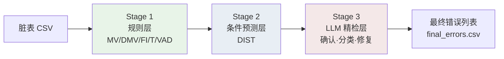
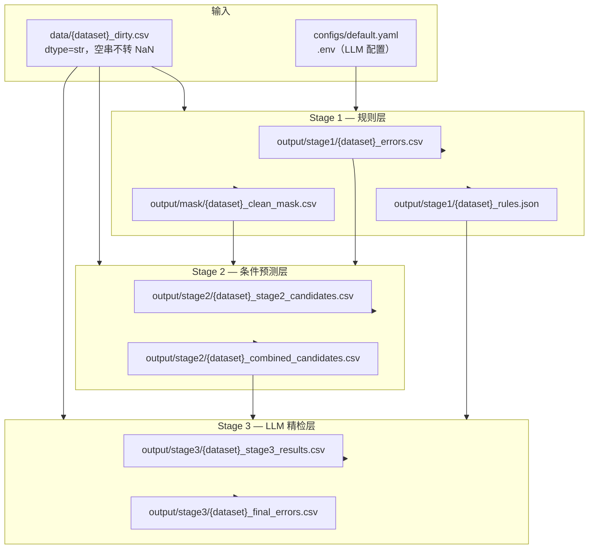
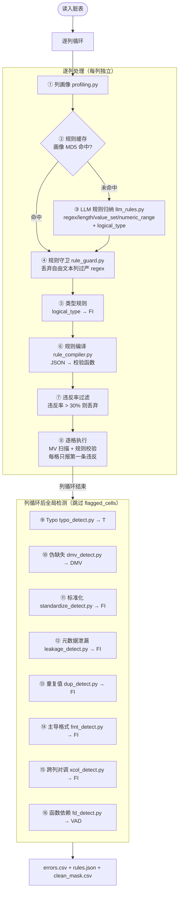
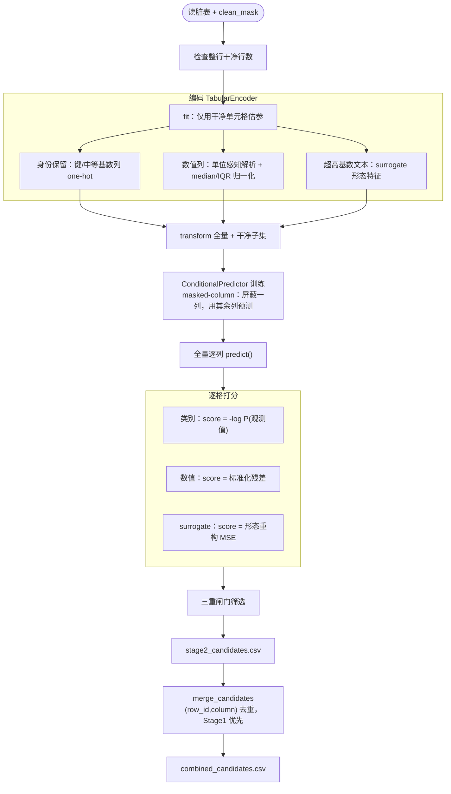
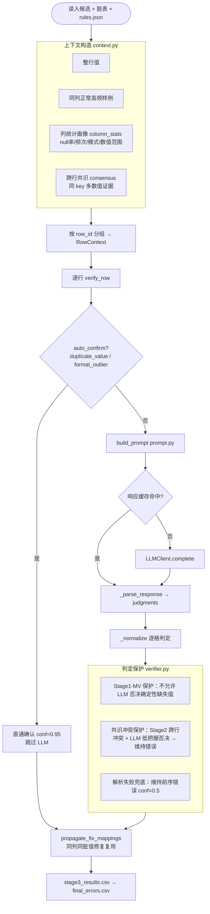

# 表格数据错误检测模型 — 模型概述

本文档介绍本项目的**三阶段表格数据错误检测模型**：整体框架、各阶段职责、输入输出、内部组成及协作关系。读者无需阅读源码即可理解模型如何工作。

---

## 1. 问题定义与设计思想

### 1.1 任务

给定一张**脏表**（CSV，每格为字符串），模型需逐单元格检测是否存在数据错误，并输出：

- 错误位置（`row_id`, `column`）
- 错误类型（MV / DMV / FI / T / VAD / OTHER 等）
- 置信度与修复建议（`suggested_fix`）

评估时以同结构的**干净表**（`{dataset}_clean.csv`）与脏表逐格对比作为 ground truth。

### 1.2 三层漏斗架构

模型采用**三层漏斗**设计，逐层放宽检测条件、逐层收紧最终输出：

| 层级 | 名称 | 检测范式 | 核心目标 |
|------|------|----------|----------|
| Stage 1 | 规则层 | 显式规则 + 统计 + LLM 辅助归纳 | 高精度检出**可写成规则**的明确错误 |
| Stage 2 | 条件预测层 | 无监督 `P(列 \| 其余列)` | 补规则层漏掉的**分布异常**与**键→值冲突** |
| Stage 3 | LLM 精检层 | 整行语义推理 + 统计画像 | **确认**、**分类**、**过滤误报**、**标准化修复** |



**设计原则：**

1. **先规则后分布**：Stage 1 用高置信、可解释的规则快速覆盖大部分明确错误；Stage 2 在干净子集上学条件分布，捕获软异常。
2. **前序召回、末级精检**：Stage 1/2 负责尽可能多地召回可疑格；Stage 3 用 LLM 结合整行上下文做最终裁决，化解误报。
3. **去重贯穿**：`(row_id, column)` 作为单元格唯一键；已标记的格不再被后续检测器重复报出；合并时 Stage 1 优先于 Stage 2。

---

## 2. 错误类型体系

各阶段产出不同类型，Stage 3 将前序类型统一为可交付的最终类型。

| 类型 | 全称 / 含义 | 主要检出阶段 | 典型场景 |
|------|-------------|--------------|----------|
| **MV** | Missing Value，缺失值 | Stage 1 | 空串、NaN、`empty` 等哨兵出现在不可空列 |
| **DMV** | Dummy Missing Value，伪缺失值 | Stage 1 | 非空但语义缺失：`?`、`unknown`、`missing`、`n.a.` |
| **FI** | Format Inconsistency，格式/类型不一致 | Stage 1（Stage 3 可细化 DIST→FI） | 正则不符、长度/范围越界、枚举非法、逻辑类型不符、元数据泄漏、列对调、重复值、主导格式偏离 |
| **T** | Typo，拼写错误 | Stage 1 | 低频 typo 相对高频锚点（编辑距离） |
| **VAD** | Value Against Dependency，跨列依赖违反 | Stage 1（Stage 3 可细化 DIST→VAD） | ZipCode↔City 不匹配、近似函数依赖违反 |
| **DIST** | Distribution anomaly，分布异常 | Stage 2 | 条件概率极低、数值残差过大、形态重构误差高 |
| **OTHER** | 其他语义错误 | Stage 3 | LLM 判定为错误但无法归入上述类别 |
| **NONE** | 非错误（误报否决） | Stage 3 | 前序候选经 LLM 判定为合法值，不进入最终结果 |

**Stage 3 类型映射：**

| 前序类型 | LLM 可输出的最终类型 |
|----------|---------------------|
| MV / DMV / FI / T / VAD | 维持原类型或修正 |
| DIST | VAD / FI / DMV / OTHER / **NONE** |
| NONE | 不写入 `final_errors.csv` |

---

## 3. 整体数据流



**运行顺序（必须按序执行）：**

```powershell
python main.py --input data/hospital_dirty.csv          # Stage 1
python -m stage_2.cli --input data/hospital_dirty.csv   # Stage 2
python -m stage_3.cli --input data/hospital_dirty.csv   # Stage 3
```

**目录约定：** 原始数据在 `data/`；生成物在 `output/mask|stage1|stage2|stage3/`；LLM 缓存在 `cache/`。路径由 `--input` 自动推导，详见 `paths/layout.py`。

---

## 4. Stage 1 — 规则层

### 4.1 阶段功能

Stage 1 是流水线的**第一道关卡**，负责检出能用**明确规则或统计方法**描述的错误。特点是精度高、可解释、规则可缓存（LLM 仅用于规则归纳，不逐格调用）。

**擅长：** 格式明确可规则化的错误；强跨列函数依赖；高频拼写 typo；缺失值与伪缺失值；逻辑类型不符。

**不擅长：** 软统计型跨列异常；数值离群但仍在合法范围内；难以写成规则的语义错误。

### 4.2 输入与输出

| 方向 | 路径 / 来源 | 说明 |
|------|-------------|------|
| **输入** | `data/{dataset}_dirty.csv` | 待检测脏表 |
| **输入** | `configs/default.yaml` | 规则执行、各检测器开关与阈值 |
| **输入** | `.env` | LLM API 密钥与模型配置 |
| **输出** | `output/stage1/{dataset}_errors.csv` | 检出的错误单元格列表 |
| **输出** | `output/stage1/{dataset}_rules.json` | 每列归纳规则与 `semantic_type`（供 Stage 3） |
| **输出** | `output/mask/{dataset}_clean_mask.csv` | 布尔掩码，`True`=干净（**Stage 2 训练必需**） |
| **缓存** | `cache/rule_cache.json` | 列画像 MD5 → LLM 归纳规则 |

**errors.csv 核心字段：**

| 字段 | 说明 |
|------|------|
| `row_id, column, value` | 错误位置与当前值 |
| `error_type` | MV / DMV / FI / T / VAD |
| `violated_rule` | 触发的规则类型（如 `regex`、`missing_value`、`fd_violation`） |
| `reason` | 人类可读原因 |
| `suggested_fix, confidence` | 修复建议与置信度（部分检测器填写） |

### 4.3 内部组成

Stage 1 由**逐列规则流水线**与**列循环后的全局检测器**两部分组成，按 Cocoon 原则排序：字符/值级 → 列级格式/类型 → 跨列依赖。



#### 4.3.1 逐列规则流水线

| 序号 | 模块 | 作用 |
|------|------|------|
| ① | `profiling.py` | 统计列画像：空值率、模式分布、数值统计、字符集、边界样例（不调 LLM） |
| ② | `rule_cache.py` | 以列画像 MD5 为键缓存 LLM 归纳结果，避免重复调用 |
| ③ | `llm_rules.py` | 调用 LLM 从画像归纳列规则（regex、length、value_set、numeric_range 等）及 `logical_type`、`semantic_type` |
| ④ | `rule_guard.py` | 对自由文本/高多样性列丢弃过严 regex，降低误报 |
| ⑤ | `_build_type_rule` | 由 `logical_type`（bool/int/float/date）派生类型一致性规则 → FI |
| ⑥ | `rule_compiler.py` | 将 JSON 规则编译为可执行的 `f(value) → (error_type, rule) \| None` |
| ⑦ | `filter_bad_rules` | 违反率超过 `max_violation_rate`（默认 30%）的规则丢弃 |
| ⑧ | 单元格执行 | 不可空列先扫 MV；再按保留规则顺序执行，**首条违反即停止**；结果记入 `flagged_cells` |

#### 4.3.2 列循环后全局检测器

| 序号 | 模块 | 错误类型 | 作用 |
|------|------|----------|------|
| ⑨ | `typo_detect.py` | T | 频次 + Levenshtein 编辑距离：低频值相对高频锚点的拼写错误 |
| ⑩ | `dmv_detect.py` | DMV | 词表匹配识别语义缺失占位值（`?`/`unknown`/`missing` 等） |
| ⑪ | `standardize_detect.py` | FI | LLM 归纳列内规范表示形态，标记与多数派不一致的取值 |
| ⑫ | `leakage_detect.py` | FI/metadata_leakage | 识别 RIS/MEDLINE/PubMed 标签混入字段值，长度离群门控降误报 |
| ⑬ | `dup_detect.py` | FI/duplicate_value | 整值由同一 token 重复拼接（如 `X,X`）的冗余复制 |
| ⑭ | `fmt_detect.py` | FI/format_outlier | 格式高度统一列中偏离主导形态的值；双门控跳过自由文本/合法多形态列 |
| ⑮ | `xcol_detect.py` | FI/column_swap | 统计发现"全名↔标准缩写"列对，LLM 语义确认后标记对调行 |
| ⑯ | `fd_detect.py` | VAD | 近似函数依赖（FD）挖掘；可选 LLM 语义校验过滤伪依赖 |

#### 4.3.3 辅助机制

| 机制 | 说明 |
|------|------|
| `flagged_cells` 去重 | `(row_id, column)` 集合贯穿全流程；已标记格跳过后续检测 |
| `build_clean_mask` | 以 errors 取反生成与表同形的布尔掩码，供 Stage 2 训练 |
| 可空列推断 | `nullable_columns` 显式配置，或 `infer_nullable` 根据 LLM 无 `not_null` + 高空值率推断 |
| 配置开关 | 各检测器均可通过 `configs/default.yaml` 的 `execution.*` 段独立启停 |

**入口：** `python main.py` → `stage_1.cli.main()` → `run_rule_layer()`（`stage_1/executor.py`）

---

## 5. Stage 2 — 条件预测层

### 5.1 阶段功能

Stage 2 在 Stage 1 标记的**干净子集**上学习每一列的**条件分布** `P(列 | 其余列)`，对**全量数据**打分，检出规则层漏掉的可疑单元格，统一标为 **DIST**。

**核心思想：** 一个单元格是否为错误，取决于「它的取值能否由同一行其余列预测出来」。该单一机制同时覆盖：

| 场景 | 例子 | 机制 |
|------|------|------|
| 分布型异常 | 拼写 typo、未知类别、数值离群 | 行上下文给观测值低概率 / 大残差 |
| 键→值冲突 | 多来源航班时刻不一致 | `P(time \| flight)` 集中在共识取值，偏离者低概率 |

完全**无监督**，不依赖 ground truth，**一个通用模型、无需按数据集路由**。

**擅长：** Stage 1 漏掉的类别 typo / 未知枚举；数值离群；多来源键→值冲突。

**不擅长：** 天然无强共识的列；标识列（由可预测性闸门跳过）；单独精度低于 Stage 1，误报交 Stage 3 过滤。

### 5.2 输入与输出

| 方向 | 路径 / 来源 | 说明 |
|------|-------------|------|
| **输入** | `data/{dataset}_dirty.csv` | 待检测脏表（全量打分） |
| **输入** | `output/mask/{dataset}_clean_mask.csv` | Stage 1 干净掩码（**训练必需**） |
| **输入** | `output/stage1/{dataset}_errors.csv` | 用于与 Stage 2 候选合并去重 |
| **输出** | `output/stage2/{dataset}_stage2_candidates.csv` | Stage 2 独立检出的 DIST 候选 |
| **输出** | `output/stage2/{dataset}_combined_candidates.csv` | Stage1 ∪ Stage2 合并（**Stage 3 输入**） |

**stage2_candidates.csv 额外字段：**

| 字段 | 说明 |
|------|------|
| `error_type` | 恒为 `DIST` |
| `anomaly_score` | 异常分数（类别：`-log P(观测)`；数值：标准化残差；文本：surrogate MSE） |
| `suggested_fix` | 模型最偏好的替代取值（精度闸门通过时） |
| `subtype` | `categorical` / `numeric` / `surrogate` |

**combined_candidates.csv 额外字段：**

| 字段 | 说明 |
|------|------|
| `source` | `stage1` 或 `stage2`（同格冲突时 Stage 1 优先） |

### 5.3 内部组成



| 模块 | 文件 | 作用 |
|------|------|------|
| **表格编码** | `encoding.py` | `TabularEncoder`：将表格转为数值张量；身份保留 one-hot（键列/中等基数列）；数值列单位感知解析；超高基数文本走 surrogate 特征；输出逐列 `ColumnSpec` |
| **条件预测模型** | `model.py` | `ConditionalPredictor`：共享编码器 + 逐列预测头；masked-column 训练（屏蔽目标列，用其余列预测） |
| **打分与闸门** | `score.py` | 逐格似然/残差计算；干净子集分位阈值；类别列 `abs_prob_floor` 绝对概率地板；`margin` 精度闸门；`min_predictability` 可预测性闸门；`run_stage2()` 编排全流程 |
| **IO 与合并** | `io_utils.py` | 表格/掩码读取；`merge_candidates` 按 `(row_id, column)` 去重合并 |

#### 5.3.1 打分逻辑

| 列类型 | 分数计算 | 可疑判定 |
|--------|----------|----------|
| 类别（categorical） | `-log P(观测值 \| 其余列)` | 分数 > 干净分位阈值，**或** `P(观测) < abs_prob_floor` |
| 数值（numeric） | `\|预测 - 观测\|` 的标准化残差 | 分数 > 干净分位阈值 |
| 超高基数文本（surrogate） | 形态特征重构 MSE | 分数 > 干净分位阈值 |

#### 5.3.2 三重闸门

| 闸门 | 参数 | 作用 |
|------|------|------|
| 分位阈值 | `quantile` | 逐列在干净单元格分数分布上取高分位，无监督自适应 |
| 精度闸门 | `margin` | 类别列：仅当模型偏好的替代类概率显著高于观测值时才报，并给出 `suggested_fix` |
| 可预测性闸门 | `min_predictability` | 跳过难以从上下文预测的标识列，控误报 |

**训练约束：** 仅在 `clean_mask` 标记为干净的单元格上拟合编码器与模型，避免把已知错误学进分布；推断时对全量行（含脏行）打分以发现漏报。

**入口：** `python -m stage_2.cli` → `run_stage2()`（`stage_2/score.py`）

---

## 6. Stage 3 — LLM 精检层

### 6.1 阶段功能

Stage 3 对 Stage 1 + Stage 2 合并后的**可疑单元格候选**做语义级精检。利用 LLM 理解整行上下文、列语义类型、同列正常样例与统计画像，完成：

1. **确认**是否为真错误（`is_error`）
2. **修正**错误类型（如 DIST → VAD / FI / NONE）
3. **过滤**误报（判为 NONE 的不进入最终结果）
4. **输出**标准化修复建议（`suggested_fix`）

**擅长：** 化解 Stage 2 分布误报；识别派生列语义；跨列一致性判断；给出可解释的 `llm_reason`。

**不擅长：** 完全未被前序阶段召回的错误；依赖 LLM API 成本与稳定性。

### 6.2 输入与输出

| 方向 | 路径 / 来源 | 说明 |
|------|-------------|------|
| **输入** | `data/{dataset}_dirty.csv` | 原始脏表（取整行上下文） |
| **输入** | `output/stage2/{dataset}_combined_candidates.csv` | Stage1 ∪ Stage2 可疑候选 |
| **输入** | `output/stage1/{dataset}_rules.json` | 列 `semantic_type` |
| **输入** | `.env` | LLM API 配置 |
| **输出** | `output/stage3/{dataset}_stage3_results.csv` | 逐格判定明细（含 LLM 推理过程） |
| **输出** | `output/stage3/{dataset}_final_errors.csv` | **最终确认错误**（`is_error=True`） |
| **缓存** | `cache/stage3_cache.json` | 相同 prompt 的 LLM 响应缓存 |

**stage3_results.csv 核心字段：**

| 字段 | 说明 |
|------|------|
| `prior_error_type, prior_source` | 前序阶段判定类型与来源 |
| `is_error` | LLM 最终判定（True/False） |
| `error_type` | 最终错误类型 |
| `confidence` | 判定置信度 |
| `suggested_fix` | 标准化修复建议 |
| `llm_reason` | LLM 推理说明 |

**final_errors.csv：** 仅含 `is_error=True` 的格，字段精简为 `row_id, column, error_type, confidence, suggested_fix`。

### 6.3 内部组成



| 模块 | 文件 | 作用 |
|------|------|------|
| **上下文构造** | `context.py` | 读入候选并按 `row_id` 分组；构造 `RowContext` / `SuspectCell`；计算同列正常样例、列统计画像、跨行共识证据；标记 `auto_confirm` 格 |
| **Prompt 渲染** | `prompt.py` | 组装精检 prompt：整行 JSON + 可疑格 + 正常样例 + 列统计 + 跨行共识 |
| **LLM 精检** | `verifier.py` | 逐行调用 LLM（或直通确认）；解析 JSON 判定；应用保护机制；`propagate_fix_mappings` 修复映射复用 |
| **响应缓存** | `cache.py` | 以 prompt 文本为键缓存 LLM 响应，原子写入防截断 |
| **评估** | `evaluate.py` | 对比精检前（合并候选）与精检后（最终确认）的 P/R/F1 |

#### 6.3.1 上下文信息

| 信息 | 来源 | 用途 |
|------|------|------|
| 整行值 | 脏表 | LLM 做跨列一致性判断 |
| 列 `semantic_type` | `rules.json` | 理解列语义角色 |
| 同列正常样例 | 脏表高频合法值 | 对比可疑值是否偏离正常模式 |
| 列统计画像 | `compute_column_stats` | null 率、高频值频次、主导字符模式、数值 min/max |
| 跨行共识 | `compute_consensus` | 同 key 下多数值证据，解决多来源键→值冲突（如 flights 时刻） |

#### 6.3.2 判定保护机制

| 保护 | 触发条件 | 行为 |
|------|----------|------|
| **确定性结构错误直通** | `violated_rule ∈ {duplicate_value, format_outlier}` | 直接确认（conf=0.95），跳过 LLM；整行皆此类则整行跳过 LLM |
| **Stage1-MV 保护** | `prior_source=stage1` 且 `prior_error_type=MV`，LLM 判 NONE | 维持为错误，不因 LLM 否决而丢弃 |
| **共识冲突保护** | `prior_source=stage2` 且跨行共识冲突，LLM 低把握（<0.85）判 NONE | 维持为错误，补 `suggested_fix=majority_value` |
| **解析失败兜底** | LLM 未返回该格判定 | 维持前序错误，conf=0.5 |

#### 6.3.3 修复映射复用

`propagate_fix_mappings`：LLM 对某列某脏值给出 `old→new` 修复后，自动将同列同脏值的修复建议补全到其他未获 LLM 判定的候选格。

**入口：** `python -m stage_3.cli` → `verify_contexts()`（`stage_3/verifier.py`）

---

## 7. 三阶段协作关系

### 7.1 维度对比

| 维度 | Stage 1 | Stage 2 | Stage 3 |
|------|---------|---------|---------|
| 检测范式 | 规则 + 统计 + LLM 辅助归纳 | 无监督条件预测 P(列\|其余列) | LLM 语义推理 + 统计画像 |
| 主要目标 | 高精度召回明确错误 | 补规则层盲点 | 确认、分类、过滤误报、标准化修复 |
| 产出错误类型 | MV / DMV / FI / T / VAD | DIST | 维持前序或细化为 VAD/FI/DMV/OTHER/NONE |
| 可解释性 | 高（规则、reason） | 中（anomaly_score、subtype） | 高（llm_reason、suggested_fix） |
| LLM 使用 | 规则归纳（按列，可缓存） | 无 | 逐行精检（可缓存） |
| 精度倾向 | 高 P，R ~85% | 中等 P，补召回 | 提升最终 P，输出可交付结果 |

### 7.2 数据依赖链

```
Stage 1 ──→ clean_mask ──→ Stage 2 训练
         ──→ errors ──────→ Stage 2 合并
         ──→ rules.json ──→ Stage 3 prompt

Stage 2 ──→ combined_candidates ──→ Stage 3 输入

Stage 3 ──→ final_errors.csv（最终交付物）
```

**关键约束：**

- Stage 1 **必须先运行**（产出 `clean_mask` 与 `errors`）
- Stage 2 依赖 Stage 1 的 `clean_mask` 训练、`errors` 合并
- Stage 3 依赖 Stage 2 的 `combined_candidates` 与 Stage 1 的 `rules.json`
- 评估需 `data/{dataset}_clean.csv` 作为 ground truth

### 7.3 输出字段演进

| 阶段 | 新增核心字段 |
|------|-------------|
| Stage 1 | `error_type, violated_rule, reason` |
| Stage 2 | `anomaly_score, subtype`；`error_type=DIST` |
| 合并后 | `source`（stage1 / stage2） |
| Stage 3 明细 | `prior_*`, `is_error`, `confidence`, `llm_reason` |
| 最终输出 | `row_id, column, error_type, confidence, suggested_fix` |

---

## 8. 评估

评估脚本以 clean vs dirty 逐格差异为 ground truth，对比各阶段检出效果：

```powershell
python -m stage_2.evaluate --dirty data/hospital_dirty.csv   # Stage1 / Stage2 / 合并
python -m stage_3.evaluate --dirty data/hospital_dirty.csv   # 精检前 vs 精检后
```

| 评估脚本 | 对比对象 |
|----------|----------|
| `stage_2.evaluate` | Stage 1 单独、Stage 2 单独、合并 S1∪S2 的 P/R/F1 |
| `stage_3.evaluate` | 精检前（合并候选）vs 精检后（final_errors）的 P/R/F1；按列误报化解 Top-N |

---

## 9. 代码入口速查

| 阶段 | CLI 命令 | 核心函数 | 配置 |
|------|----------|----------|------|
| Stage 1 | `python main.py --input data/{dataset}_dirty.csv` | `run_rule_layer()` | `configs/default.yaml` |
| Stage 2 | `python -m stage_2.cli --input data/{dataset}_dirty.csv` | `run_stage2()` | `stage_2/config.py` |
| Stage 3 | `python -m stage_3.cli --input data/{dataset}_dirty.csv` | `verify_contexts()` | `stage_3/config.py` |

**Stage 3 建议用法：** 先 `--dry-run --limit 3` 确认 prompt，再全量运行；可用 `--limit N` 小规模试跑以控制 LLM 成本。

---

## 附录：可选的单轮回灌工具

主流程中 `clean_mask` 仅由 Stage 1 errors 取反构建。可选工具 `stage_2/refine_mask.py` + `run_feedback.py` 支持将 Stage 3 高置信判定回灌掩码后重训 Stage 2，用于提纯训练分布。该功能**未接入主流程**，按需使用。详见 `stage_2/refine_mask.py`。
