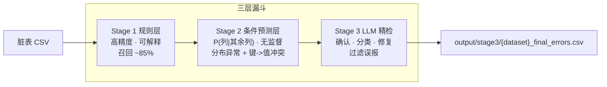
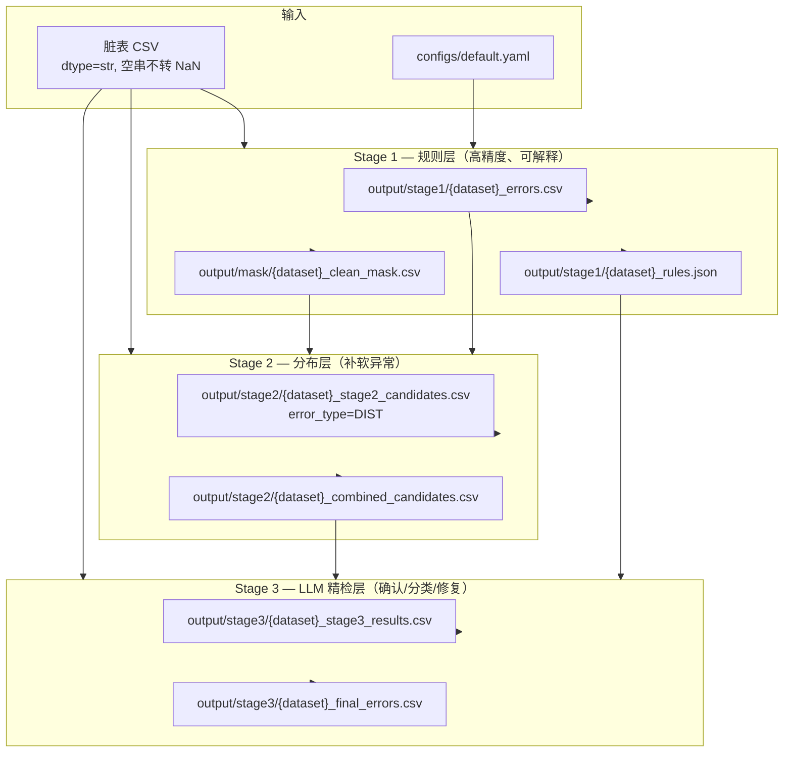
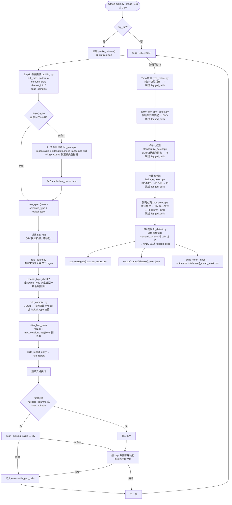
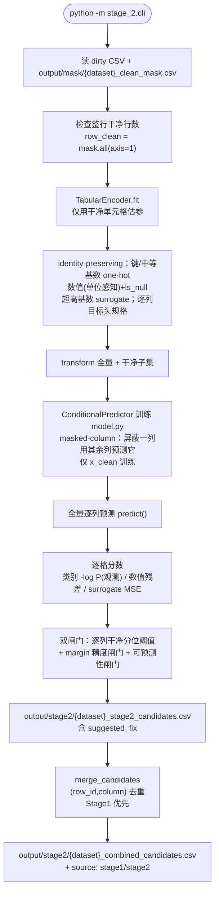
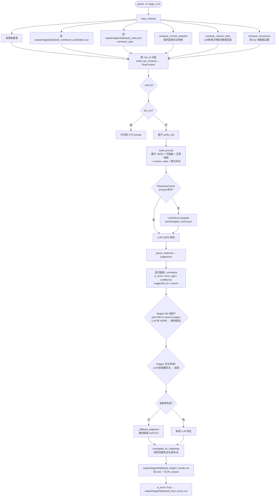
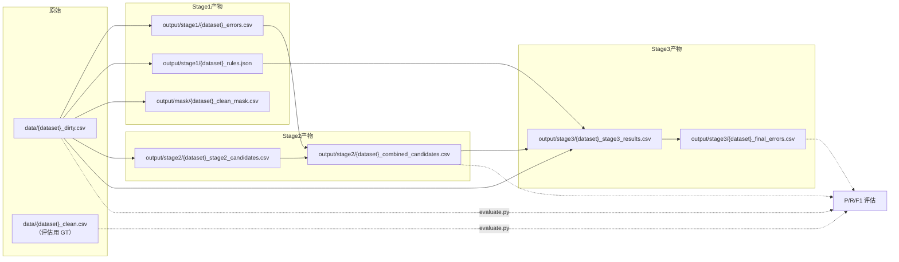
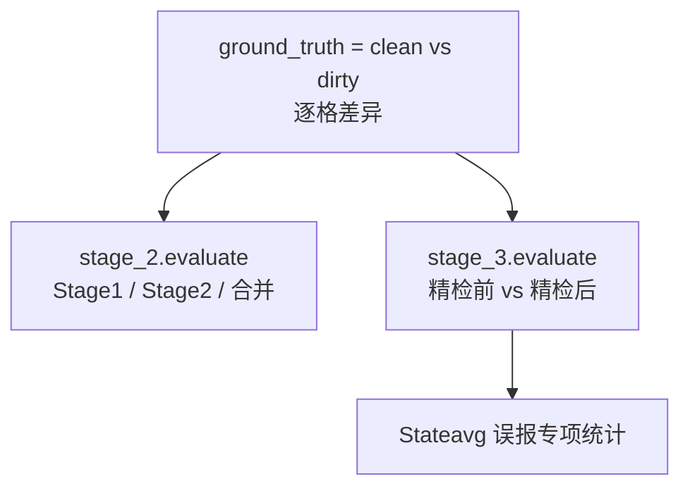
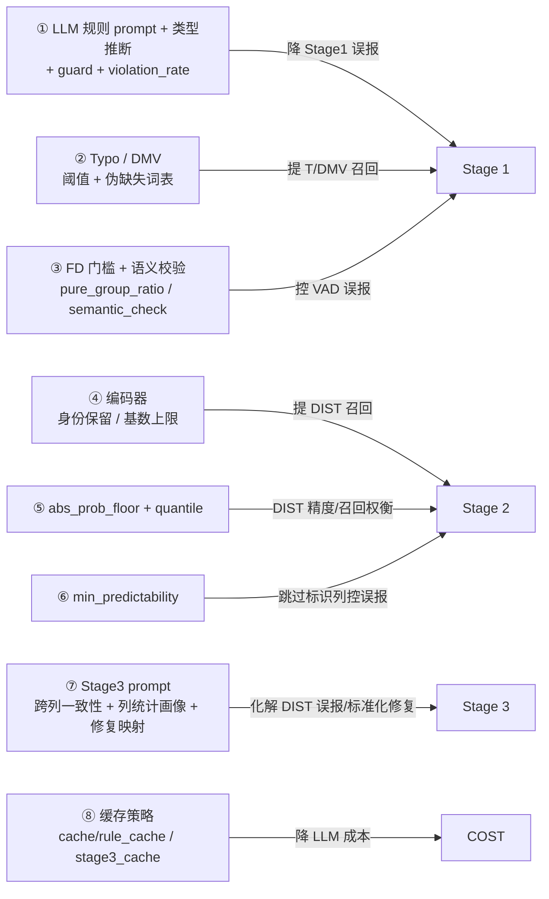

# 表格数据错误检测流水线 — 流程图与优化指南

本文档描述 Stage 1 / Stage 2 / Stage 3 三阶段表格错误检测的完整流程，便于后续召回、精度、成本与阈值优化。

**典型运行顺序（路径由 `--input` 自动推导，PowerShell 一行命令）：**

```powershell
# 1. Stage 1
python main.py --input data/hospital_dirty.csv

# 2. Stage 2
python -m stage_2.cli --input data/hospital_dirty.csv

# 3. Stage 3
python -m stage_3.cli --input data/hospital_dirty.csv

# 评估
python -m stage_2.evaluate --dirty data/hospital_dirty.csv
python -m stage_3.evaluate --dirty data/hospital_dirty.csv
```

**目录布局：** `data/` 仅原始数据集；生成物写入 `output/mask|stage1|stage2|stage3/`；LLM 缓存写入 `cache/`。命名：`{dataset}_*.csv/json`（如 `hospital_clean_mask.csv`）。布局可在 [configs/default.yaml](configs/default.yaml) 的 `layout` 段配置。

> **缓存提示：** Stage 1 规则归纳 prompt 已新增 `logical_type` 字段；若复用旧的 `cache/rule_cache.json`，缓存命中将拿不到该字段（类型校验对该列不生效）。如需让列类型校验全面生效，首次重跑前删除 `cache/rule_cache.json`。Stage 3 prompt 变更会因 prompt 文本改变自动触发缓存 miss，无需手动清。

---

## 各 Stage 作用详解

本流水线采用**三层漏斗**设计：先用高置信、可解释的规则快速筛出大部分明确错误；再用分布模型补规则层漏掉的软异常；最后用 LLM 结合整行上下文做确认、分类与修复建议。三层各司其职，逐级放宽检测条件、逐级收紧最终输出。



---

### Stage 1 — 规则层（高精度、可解释）

**定位：** 流水线的第一道关卡，负责检出**能用明确规则或统计方法描述**的错误。特点是精度高、可解释、成本低（规则可缓存），是后续 Stage 2/3 的基础。

**核心职责：**

| 职责 | 说明 |
|------|------|
| 逐列规则检测 | 借助 LLM 从列画像归纳 regex / 长度 / 数值范围 / 取值集合等规则，逐格校验 |
| 缺失值扫描 | 独立检测 MV，不依赖 LLM |
| 伪缺失值检测 | 词表匹配识别非空但语义为缺失的占位值（`?`/`unknown`/`missing`/占位数字），标 DMV（借鉴 Cocoon） |
| 列类型一致性校验 | LLM 推断列逻辑类型（bool/int/float/date），校验不符该类型的值，标 FI（借鉴 Cocoon） |
| 拼写错误检测 | 基于频次 + 编辑距离，发现低频值与高频锚点的近似拼写（T） |
| 标准化检测 | LLM 归纳列内规范表示形态，标记不一致取值（FI） |
| 元数据泄漏检测 | 识别 RIS/MEDLINE/PubMed 标签混入字段值（FI/metadata_leakage），长度离群门控降误报 |
| 跨列对调检测 | 宽松统计发现"全名↔标准缩写"列对，LLM 语义确认后标记两列对调行（FI/column_swap） |
| 跨列依赖挖掘 | 近似函数依赖（FD）挖掘，发现如 ZipCode → City 的强依赖违反（VAD） |
| FD 语义校验 | 统计候选 FD 后用 LLM 复核其是否现实语义上成立，仅确认者产出 VAD（借鉴 Cocoon，降伪依赖误报） |
| 产出干净掩码 | 生成 `output/mask/{dataset}_clean_mask.csv`，供 Stage 2 训练 |
| 产出列语义类型 | 生成 `output/stage1/{dataset}_rules.json`，供 Stage 3 构造 prompt |

**能检出的错误类型：**

| 类型 | 含义 | 典型场景 |
|------|------|---------|
| **MV** | 缺失值 | 空串、`empty`、NaN 等哨兵出现在不可空列 |
| **DMV** | 伪缺失值 | 非空但语义为缺失：`?`、`unknown`、`missing`、`n.a.`、占位数字 `9999` |
| **FI** | 格式 / 长度 / 范围 / 取值集合 / 逻辑类型 / 元数据泄漏 / 列对调 | 电话格式错误、ZIP 非 5 位、数值超范围、非法枚举、yes/no 列混入数字；RIS 标签泄漏；期刊全名/缩写两列互换 |
| **T** | 拼写错误 | `birmingham` 写成 `birminghm`，低频 typo 相对高频锚点 |
| **VAD** | 跨列依赖违反 | ZipCode 与 City 不匹配、MeasureCode 与 Condition 不一致 |

**处理顺序（借鉴 Cocoon）：** 字符/值级（MV、DMV、T）→ 列级格式/类型（FI）→ 跨列依赖（VAD），先解决字符级问题再做需要跨列理解的判断，避免顺序导致的连锁误报。

**擅长与不擅长：**

- **擅长：** 格式明确、可写成规则的错误；强跨列依赖；高频拼写 typo；缺失值与伪缺失值；明确逻辑类型不符。hospital 上精度约 0.97，召回约 0.85。
- **不擅长：** 软统计型跨列异常（达不到 FD 阈值但联合分布异常）；数值离群但仍在合法范围内；难以写成规则的语义错误；Stage 1 漏报的列（如部分 `MeasureName`、`HospitalType` typo）。

**输入 / 输出：**

| 方向 | 文件 | 说明 |
|------|------|------|
| 输入 | `data/hospital_dirty.csv` | 待检测脏表 |
| 输入 | `configs/default.yaml`、`.env` | LLM 与规则执行参数 |
| 输出 | `output/stage1/{dataset}_errors.csv` | 检出的错误单元格及类型、原因 |
| 输出 | `output/stage1/{dataset}_rules.json` | 归纳规则与列语义类型 |
| 输出 | `output/mask/{dataset}_clean_mask.csv` | 布尔掩码，True=干净（Stage 2 必需） |

**关键机制：** `flagged_cells` 去重贯穿全流程；规则违反率超 30% 自动丢弃（逻辑类型规则也受此兜底，避免误判类型造成系统性误报）；LLM 规则按列画像 MD5 缓存至 `cache/rule_cache.json`。DMV / 类型校验 / FD 语义校验均有配置开关（`execution.dmv.enabled` / `execution.enable_type_check` / `execution.fd.semantic_check`），默认开启、可关闭回滚。

---

### Stage 2 — 条件预测层（无监督，分布异常 + 键->值冲突）

**定位：** 流水线的第二道关卡，在 Stage 1 已标记的「干净子集」上学习每一列的**条件分布** `P(列 | 其余列)`，对全量数据打分，检出规则层漏掉的可疑单元格（统一标 `DIST`）。完全无监督，不依赖 ground truth 标签，**一个通用模型、无需按数据集路由**。

**核心思想：** 一个单元格是否为错误，取决于「它的取值能否由同一行其余列预测出来」。该单一机制同时覆盖两类错误：

| 错误类型 | 例子 | 为什么能抓到 |
|------|------|------|
| **分布型异常** | 拼写、未知类别、数值越界（hospital） | 行上下文给观测值低概率 / 大残差 |
| **键->值冲突 / 真值发现** | 某来源把航班时刻写错（flights） | `P(time \| flight)` 集中在该航班共识取值，偏离者得到低概率 |

**核心职责：**

| 职责 | 说明 |
|------|------|
| 身份保留编码 | 提高类别基数上限（默认 500），让键列（`flight`）与中等基数列（时刻）以 one-hot 身份进入；仅超高基数文本走 surrogate |
| 条件建模 | 在整行干净样本上训练 `ConditionalPredictor`：屏蔽一列，用其余列预测它（masked-column） |
| 似然打分 | 对全量行预测：类别 `-log P(观测值)`、数值标准化残差、surrogate 形态重构 MSE |
| 双闸门筛选 | 逐列干净分位阈值 + 精度闸门 `margin`（备选类显著更优才报，并给 `suggested_fix`）+ 可预测性闸门（难预测列跳过） |
| 与 Stage 1 合并 | 按 `(row_id, column)` 去重，Stage 1 优先，产出 `output/stage2/{dataset}_combined_candidates.csv` |

**为什么替换旧的 DAE/GANomaly：** 旧版把高基数列（`flight`、各时刻列）一律丢进 surrogate 哈希通道，键与取值的**身份被抹掉**，无法学到 `flight -> time`，在 flights 上只会标记「长度异常的格式」而漏掉真正冲突，合并精度从 0.999 崩到 0.814。条件预测 + 身份保留编码从根本上解决该问题。

**编码层要点：**

- 类别/键/中等基数列（含时刻、ID）：`one-hot` + `__UNK__` + 频率 + `is_null`，作 `categorical` 目标头
- 数值列：单位感知解析（`97%`、`33 patients`）+ median/IQR 归一化 + `is_null`，作 `numeric` 目标头
- 超高基数文本（> 上限）：surrogate 特征（长度、字符比例、频次、是否在干净集、n-gram hash），作 `surrogate` 目标头

**擅长与不擅长：**

- **擅长：** Stage 1 漏掉的类别 typo / 未知枚举；数值离群；**多来源键->值冲突（如航班时刻）**——这是旧设计完全无能为力的。
- **不擅长：** 天然无强共识的列（如航班 `act_*` 实际时刻、`Sample` 计数）；标识列自身（由可预测性闸门跳过）；Stage 2 单独精度低于 Stage 1，误报交 Stage 3 过滤。

**输入 / 输出：**

| 方向 | 文件 | 说明 |
|------|------|------|
| 输入 | `data/hospital_dirty.csv` | 待检测脏表 |
| 输入 | `output/mask/{dataset}_clean_mask.csv` | Stage 1 干净掩码（训练必需） |
| 输入 | `output/stage1/{dataset}_errors.csv` | 用于合并去重 |
| 输出 | `output/stage2/{dataset}_stage2_candidates.csv` | DIST 候选（含 `suggested_fix`） |
| 输出 | `output/stage2/{dataset}_combined_candidates.csv` | Stage1 ∪ Stage2 合并（**Stage 3 输入**） |

**关键参数：** `abs_prob_floor`（类别列绝对概率地板，召回主杠杆，默认 0.02）、`quantile`（逐列干净分位阈值，保精度）、`margin`（类别精度闸门）、`min_predictability`（可预测性闸门，跳过标识列）、`max_cells_per_row`（每行 top-N，0=不限）。

---

### Stage 3 — LLM 精检层（确认、分类、修复）

**定位：** 流水线的最后一道关卡，对 Stage 1 + Stage 2 合并后的**可疑单元格候选**做语义级精检。利用 LLM 理解整行上下文、列语义类型与同列正常样例，完成**确认是否为真错误、修正错误类型、给出修复建议、否决误报**。

**核心职责：**

| 职责 | 说明 |
|------|------|
| 上下文构造 | 按 `row_id` 分组，组装整行值 + 可疑格 + 列语义类型 + 同列正常高频样例 |
| 统计画像注入 | 为每个可疑列附带 null 率、高频值频次、主导字符模式、数值 min/max，让 LLM 基于分布判断（借鉴 Cocoon） |
| 跨行共识证据 | 自动探测 key 列，为候选列计算同 key 多数值证据（解决 flights 多源时刻冲突） |
| LLM 精检 | 一次 LLM 调用处理一行内多个可疑格，输出 JSON 判定 |
| 误报过滤 | 将前序 DIST 误报（如 `Stateavg` 派生列）判为 `NONE`，不再进入最终结果 |
| 确定性 MV 保护 | Stage 1 来源的 MV 不允许被 LLM 二次否决（确定信号；多数据集验证零误报回退） |
| 共识冲突保护 | Stage 2 来源且跨行共识冲突的候选，LLM 低把握（<0.85）否决时驳回，维持为错误 |
| 类型细化 | 将笼统的 `DIST` 细分为 VAD / FI / OTHER 等，或维持 MV/DMV/FI/T/VAD |
| 修复建议 + 映射复用 | 输出标准化 `suggested_fix`（old→new 映射），并把同列同脏值的修复在单元格间复用补全（借鉴 Cocoon） |
| 响应缓存 | `cache/stage3_cache.json` 缓存相同 prompt 的 LLM 响应，原子写防截断损坏 |

**错误类型映射：**

| 前序类型 | LLM 可输出的最终类型 | 说明 |
|---------|---------------------|------|
| MV / DMV / FI / T / VAD | 维持或修正 | Stage 1 高置信结果，LLM 可确认或纠正 |
| DIST | VAD / FI / DMV / OTHER / **NONE** | 分布层候选，LLM 结合跨列语义与列统计画像判断真伪 |
| NONE | — | 误报否决，不进入 `output/stage3/{dataset}_final_errors.csv` |

**擅长与不擅长：**

- **擅长：** 化解 Stage 2 的分布误报（跨列一致性、派生列语义）；借助列统计画像识别 string/pattern/numeric outlier 与伪缺失；对模糊候选给出可解释的 `llm_reason` 与标准化 `suggested_fix`；提升合并候选集的最终精度。
- **不擅长：** 完全未被前序阶段召回的错误（无法精检未候选的格）；依赖 LLM API 成本与稳定性；解析失败时保守兜底（维持前序错误，confidence=0.5）。

**输入 / 输出：**

| 方向 | 文件 | 说明 |
|------|------|------|
| 输入 | `data/{dataset}_dirty.csv` | 原始脏表（取整行上下文） |
| 输入 | `output/stage2/{dataset}_combined_candidates.csv` | Stage1 ∪ Stage2 可疑候选 |
| 输入 | `output/stage1/{dataset}_rules.json` | 列 `semantic_type` |
| 输入 | `.env` | LLM API 配置 |
| 输出 | `output/stage3/{dataset}_stage3_results.csv` | 逐格判定明细（含 `is_error`、`confidence`、`llm_reason`） |
| 输出 | `output/stage3/{dataset}_final_errors.csv` | **最终确认错误**（`is_error=True` 的格） |

**建议用法：** 先 `--dry-run --limit 3` 确认 prompt，再全量运行；可用 `--limit N` 小规模试跑以控制成本。

---

### 三阶段协作关系小结

| 维度 | Stage 1 | Stage 2 | Stage 3 |
|------|---------|---------|---------|
| 检测范式 | 规则 + 统计 + LLM 辅助 | 无监督条件预测 P(列\|其余列) | LLM 语义推理 + 统计画像 |
| 主要目标 | 高精度召回明确错误 | 补规则层盲点 | 确认、分类、过滤误报、标准化修复 |
| 错误类型 | MV / DMV / FI / T / VAD | DIST | 维持前序或细化为 VAD/FI/DMV/OTHER/NONE |
| 可解释性 | 高（规则、reason） | 中（重构误差、列贡献） | 高（llm_reason、suggested_fix） |
| 成本 | LLM 规则归纳（可缓存） | CPU 训练（无 LLM） | LLM 按行精检（可缓存） |
| 精度倾向 | 高 P，R ~85% | 中等 P，补召回 | 提升最终 P，输出可交付结果 |

**数据依赖链：** Stage 1 必须先跑（产出 `output/mask/{dataset}_clean_mask.csv`）→ Stage 2 → Stage 3。评估需 `data/{dataset}_clean.csv` 作为 ground truth。

---

## 一、整体架构（三层漏斗）



**设计思想：**

- **Stage 1**：硬规则 + 统计跨列 + LLM 辅助（规则归纳 / 列类型推断 / FD 语义校验），高精度、可解释（MV / DMV / FI / T / VAD）
- **Stage 2**：在干净子集上学分布，补规则层漏掉的软异常（DIST）
- **Stage 3**：LLM 结合整行上下文 + 列统计画像做最终确认，化解误报并输出标准化 `suggested_fix`

---

## 二、Stage 1 详细流程

入口：`python main.py` 或 `stage_1.cli` → `run_rule_layer()`（`stage_1/executor.py`）



> 处理顺序（Cocoon 原则）：逐列循环内完成 MV 与 FI（含逻辑类型）→ 列循环后做字符级 T、值级 DMV → 最后做跨列 VAD。

### Stage 1 错误类型与模块对应

| 错误类型 | 含义 | 检测模块 | 特点 |
|---------|------|---------|------|
| **MV** | 缺失值 | `scan_missing_value`（独立，不依赖 LLM） | 空串 / NaN / empty 等哨兵 |
| **DMV** | 伪缺失值 | `detect_dmv`（词表，不依赖 LLM） | 非空但语义缺失：`?`/`unknown`/`missing`/占位数字 |
| **FI** | 格式 / 长度 / 范围 / 逻辑类型 | LLM 规则 + `RuleCompiler` | regex, length, numeric_range, value_set, logical_type |
| **T** | 拼写错误 | `detect_typos` | 低频值 vs 高频锚点，编辑距离 |
| **VAD** | 跨列依赖违反 | `detect_vad`（+ 可选 LLM 语义校验） | 近似 FD 挖掘，如 ZipCode → City |

### Stage 1 关键模块

| 文件 | 职责 |
|------|------|
| `profiling.py` | 列画像（统计，不调 LLM） |
| `llm_rules.py` | LLM 规则归纳（含 `logical_type`）+ `LLMClient` |
| `rule_cache.py` | 画像 MD5 → 规则缓存（`cache/rule_cache.json`） |
| `rule_guard.py` | 自由文本列丢弃过严 regex |
| `rule_compiler.py` | JSON 规则 → 可执行校验函数（含 `logical_type` 类型一致性） |
| `typo_detect.py` | 频次 + Levenshtein → T |
| `dmv_detect.py` | 伪缺失值词表匹配 → DMV |
| `standardize_detect.py` | LLM 归纳列内规范表示形态 → FI |
| `leakage_detect.py` | RIS/MEDLINE/PubMed 元数据泄漏 → FI/metadata_leakage |
| `xcol_detect.py` | 跨列"全名↔标准缩写"对调检测（统计发现 + LLM 语义确认）→ FI/column_swap |
| `fd_detect.py` | 近似 FD 挖掘 + LLM 语义校验 → VAD |

### Stage 1 去重机制

`flagged_cells: set[(row_id, column)]` 贯穿全流程：

- 规则层已标记的单元格，Typo / FD 不再重复报
- 每格规则执行时只报**第一条**违反规则

---

## 三、Stage 2 详细流程

入口：`python -m stage_2.cli` → `run_stage2()`（`stage_2/score.py`）



### Stage 2 设计要点

1. **训练数据净化**：只用 `clean_mask` 中整行干净的行训练，避免把错误学进分布
2. **推断覆盖全量**：对全部行（含脏行）打分，以发现规则层漏报
3. **身份保留编码**：键列（`flight`）/中等基数列（时刻）以 one-hot 身份进入并作类别目标，是学到 `P(time|flight)` 共识的前提
4. **统一机制**：条件预测 `P(列|其余列)` 同时覆盖分布异常与键->值冲突，无需按数据集路由
5. **双闸门控精度**：`margin`（备选类显著更优才报）+ `min_predictability`（难预测的标识列跳过）
6. **召回/精度杠杆**：`abs_prob_floor`（召回主杠杆，类别列低概率即召回）/ `quantile` / `margin`，FP 交 Stage 3 过滤

### Stage 2 关键模块

| 文件 | 职责 |
|------|------|
| `encoding.py` | 表格 → 数值张量；identity-preserving 输入 + 逐列目标头规格（`ColumnSpec`） |
| `model.py` | `ConditionalPredictor`：masked-column 训练的共享编码器 + 逐列预测头 |
| `score.py` | 逐格似然/残差 + 干净分位阈值 + margin / 可预测性闸门，`run_stage2` |
| `io_utils.py` | 表格/掩码读取、`merge_candidates` |

### Stage 2 实测结论（同一套默认参数，无数据集特判）

| 数据集 | 层 | 检出 | P | R | F1 |
| --- | --- | --- | --- | --- | --- |
| flights | Stage 1 规则层 | 2673 | 0.999 | 0.542 | 0.703 |
| flights | Stage 2 DIST | 264 | 0.871 | 0.047 | 0.089 |
| flights | **合并 S1∪S2** | 2764 | **0.986** | **0.554** | **0.710** |
| hospital | Stage 1 规则层 | 749 | 0.961 | 0.878 | 0.918 |
| hospital | Stage 2 DIST | 570 | 0.686 | 0.477 | 0.563 |
| hospital | **合并 S1∪S2** | 904 | **0.802** | **0.884** | **0.841** |

- **flights**：旧 DAE/GANomaly 使合并精度从 0.999 崩到 0.814；统一模型把键->值冲突找回（`sched_dep_time` 召回 0.97），合并精度回到 **0.986**、F1 **0.710** 反超 Stage 1。
- **hospital**：与旧设计基本持平（合并 F1 0.841，召回略升），分布型检测能力未退化。

---

## 四、Stage 3 详细流程

入口：`python -m stage_3.cli` → `verify_contexts()`（`stage_3/verifier.py`）



### Stage 3 错误类型映射

| 前序类型 | LLM 最终类型 |
|---------|-------------|
| MV / DMV / FI / T / VAD | 可维持或修正 |
| DIST | 可细分为 VAD / FI / DMV / OTHER / **NONE** |
| NONE | 误报否决（如前序 Stateavg 类误报） |

解析失败时保守兜底：维持前序错误，`confidence=0.5`。

**判定保护（保召回、零误报回退）：**

| 保护 | 触发条件 | 行为 | 配置 |
|------|---------|------|------|
| **确定性 MV 保护** | `prior_source=stage1` 且 `prior_error_type=MV`，LLM 判 `NONE` | 维持为错误，不因 LLM 高置信否决而丢弃 | `protect_stage1_mv=true`（默认）；`--no-protect-mv` 关闭 |
| **共识冲突保护** | `prior_source=stage2` 且 `consensus_conflict=true`，LLM 低把握（<0.85）判 `NONE` | 维持为错误，补 `suggested_fix=majority_value` | `reject_conf_threshold=0.85` |

**多数据集验证（MV 保护）：** rayyan F1 +0.013 / hospital F1 +0.022 / flights F1 +0.001 / beers 不变，**零精度退化**。

### Stage 3 关键模块

| 文件 | 职责 |
|------|------|
| `context.py` | 按行分组，构造 `RowContext` / `SuspectCell`；`compute_column_stats` 列统计画像；`compute_consensus` 跨行共识 |
| `prompt.py` | 渲染精检 prompt（整行 + 可疑格 + 正常样例 + 列统计画像 + 跨行共识） |
| `verifier.py` | 调用 LLM、解析 JSON、规范化判定；`propagate_fix_mappings` 修复映射复用 |
| `cache.py` | LLM 响应缓存（`cache/stage3_cache.json`） |
| `evaluate.py` | 精检前 vs 精检后 P/R/F1，按列误报化解 Top-N |

---

## 五、端到端数据流与文件产物



### 统一输出字段演进

| 阶段 | 核心字段 |
|------|---------|
| Stage 1 | `row_id, column, value, error_type(MV/DMV/FI/T/VAD), violated_rule, reason, suggested_fix, confidence` |
| Stage 2 | 上述 + `anomaly_score, col_contribution`, `error_type=DIST` |
| 合并后 | 上述 + `source` (stage1 / stage2) |
| Stage 3 明细 | 上述 + `prior_*`, `is_error`, `confidence`, `suggested_fix`, `llm_reason` |
| 最终输出 | `row_id, column, error_type, confidence, suggested_fix` |

---

## 六、评估闭环



---

## 七、优化建议（按流程节点）



| 优化方向 | 涉及文件 / 配置 | 说明 |
|---------|----------------|------|
| 规则过严/过松 | `llm_rules.py`, `rule_guard.py`, `execution.max_violation_rate` | 平衡 Stage1 P/R |
| MV 可空推断 | `is_nullable_column`, `nullable_columns` | 减少 MV 误报 |
| 伪缺失词表 | `dmv_detect.py`, `execution.dmv.*` | 调词表 / 是否检测占位数字 |
| 列类型校验 | `rule_compiler.py`, `execution.enable_type_check` | bool/int/float/date 类型一致性 |
| Typo 召回 | `typo_detect.py`, `config typo.*` | 自由文本列拼写 |
| FD 精度 | `fd_detect.py`, `execution.fd.*`, `fd.semantic_check` | 统计三门槛 + LLM 语义校验降伪依赖 |
| 条件层编码 | `encoding.py` `max_cardinality` | 身份保留、键->值冲突可检 |
| DIST 阈值 | `score.py` `abs_prob_floor`, `quantile`, `margin`, `min_predictability` | 召回/精度关键杠杆 |
| LLM 精检成本 | `stage_3/cache.py`, `--limit` | 按行分组，一次 LLM 处理多格 |
| 精检质量 | `prompt.py` 跨列原则 + 列统计画像 + 修复映射复用 | Stateavg 等派生列误报、标准化修复 |
| Stage1-MV 保护 | `verifier.py` `protect_stage1_mv` | 阻止 LLM 误杀确定性缺失值，多数据集零 FP 回退 |
| 跨列对调检测 | `xcol_detect.py` `execution.xcol.*` | 期刊全名/缩写对调等跨列错位；LLM 语义门控过滤伪对 |

---

## 七·附 A：跨列"全名↔标准缩写"对调检测

**动机：** 部分脏数据中两列语义角色固定（如 `journal_title`=全名、`journal_abbreviation`=标准缩写），
但部分行两列值被对调。这类错误单列规则/分布层均无法发现，需跨列关系检测。

**方法（借鉴 FD 语义校验）：**

1. **宽松统计发现候选列对**：full 列显著更长、abbrev 列多 token、多数行 abbrev 为 full 的严格前缀缩写。
2. **LLM 语义确认**：确认列对确为"全名↔标准缩写"关系（过滤如 `Cast↔Actors` 等伪对）。
3. **标记对调行**：full 列存了缩写、abbrev 列存了全名 → 两格均标 `FI/column_swap`，`suggested_fix` 为交换值。

**配置：** `execution.xcol.enabled`（默认 true）、`min_rows` / `min_len_ratio` / `min_abbrev_rate` / `semantic_check`。

**安全门控：** 纯统计自动发现会在 hospital/movies 等数据集误判大量伪对；LLM 语义确认后仅 rayyan 的
`journal_title↔journal_abbreviation` 通过（movies 的 `Cast↔Actors` 被拒绝），其余数据集发现 0 候选对 → **零影响**。

**rayyan 实测：** 标记 140 格 / 138 TP / 2 FP（精度 0.986）；叠加 MV 保护后端到端 F1 **0.733**（起点 0.679）。

---

## 七·附 B：单轮回灌闭环（S3 判定回写 clean_mask）

**动机：** `clean_mask` 仅由 Stage 1 errors 取反构建，Stage 2/3 判定从不回写；
Stage 1 漏报、Stage 2 发现、Stage 3 确认的脏格会以 True 污染 Stage 2 训练集。
把 Stage 3 高置信判定回灌掩码后重训 Stage 2，可提纯训练分布。

**工具（可选，未接入主流程）：**

| 文件 | 作用 |
|------|------|
| `stage_2/refine_mask.py` | 用 `stage3_results.csv` 修正掩码（tau 阈值 + MV 硬锚点 + 每列剔除上限 + `--no-include` 只剔除不找回），产出 `{dataset}_clean_mask_r1.csv` |
| `run_feedback.py` | 编排 round-0 → refine → round-1，并对比污染率与 P/R/F1 |

**flights 调参实测（LLM-free Stage2 评估；每列剔除上限若无标注为 5%）：**

| 配置 | leak% | DIST_F1 | 合并_F1 |
|------|-------|---------|---------|
| baseline（原始掩码） | 20.51 | 0.347 | 0.742 |
| tau=0.8 both（找回开启） | 18.68 | 0.341 | 0.735 |
| tau=0.8 exclude-only | 18.64 | 0.343 | 0.738 |
| tau=0.7 exclude-only | 18.38 | 0.351 | 0.744 |
| **tau=0.6 exclude-only** | 18.33 | **0.358** | **0.749** |
| tau=0.5 exclude-only | 18.32 | 0.357 | 0.748 |
| tau=0.6 exclude-only cap10% | 17.46 | 0.355 | 0.747 |
| tau=0.5 exclude-only cap20% | 17.10 | 0.350 | 0.744 |

**结论：配置得当时为稳健的小幅正收益。**

- **只剔除不找回（`--no-include`）在每个 tau 下都优于"找回"**：找回 = 把 S3 否决的格加回训练集，会引入噪声。
- **降 tau 有益但 0.6 触底**：tau 0.6/0.5/0.4 几乎相同，因 S3 置信度多 ≥0.6。
- **每列剔除上限别放大**：cap 10%/20% 虽进一步压低污染，F1 却回落——过度剔除缩小训练集、误伤稀有值（与"类别词表折叠"同源教训）。5% 恰当。
- **最优：`tau=0.6 + --no-include + cap 5%`**，DIST F1 +0.011、合并 F1 +0.007、污染 −2.18pp，P/R 双升（已设为工具默认 tau）。

**beers 交叉验证（同一最优配置 tau=0.6 + --no-include + cap 5%）：**

| 指标 | round-0 | round-1(refined) | 变化 |
|------|---------|------------------|------|
| 掩码污染 leak_rate | 9.28% | 8.28% | −1.00pp |
| Stage2(DIST) F1 | 0.236 | 0.251 | +0.015 |
| 合并(S1+S2) F1 | 0.506 | 0.512 | +0.006 |

- 方向与 flights 一致：P/R 双升、污染下降、F1 小幅正收益（剔除 264 格中 229 个确为脏，87% 精度）。
- **结论：单轮回灌（最优配置）在 flights / beers 上跨数据集一致地带来稳健小幅提升。** 收益幅度偏小，
  仍保留为按需工具（`stage_2/refine_mask.py` + `run_feedback.py`）；如需接入主流程，建议在
  `run_feedback.py` 之上加 2-3 轮迭代与收敛判据，并在更多数据集上确认无回退后再固化默认。

> 顺带修复既有 bug：`stage_2.config.set_paths_from_dataset` 此前对 `--clean-mask` /
> `--stage1-errors` / `--candidates-out` / `--combined-out` 等覆盖参数"只在无覆盖时设默认、
> 从不应用覆盖值"，导致这些 CLI 参数被静默忽略；现已修复（覆盖优先，否则数据集默认）。

---

## 八、代码入口速查

| 阶段 | CLI 入口 | 核心函数 |
|------|---------|---------|
| Stage 1 | `main.py` / `stage_1.cli` | `run_rule_layer()` |
| Stage 2 | `stage_2.cli` | `run_stage2()` |
| Stage 3 | `stage_3.cli` | `verify_contexts()` |

| 配置 | 路径 |
|------|------|
| Stage 1 | `configs/default.yaml` |
| Stage 2 | `stage_2/config.py`（代码默认 + CLI 覆盖） |
| Stage 3 | `stage_3/config.py`（代码默认 + CLI 覆盖） |
