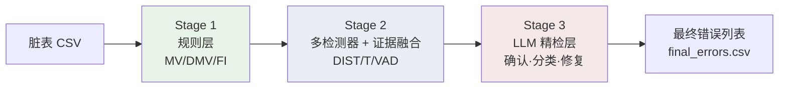
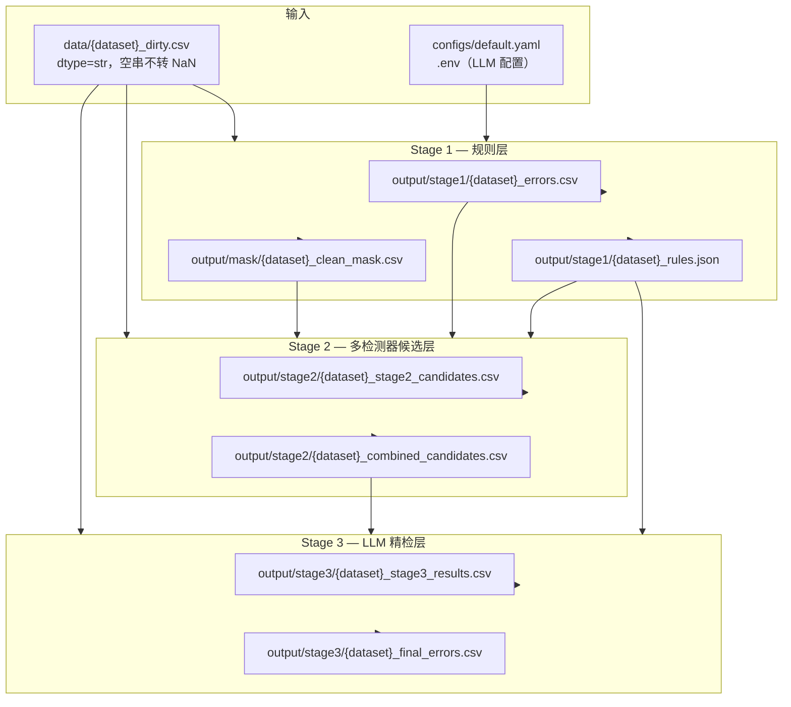
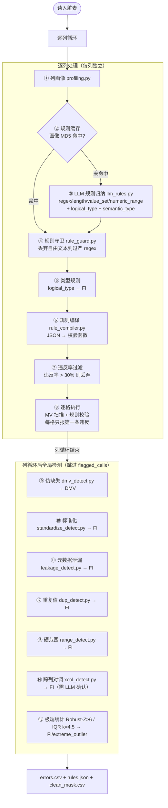
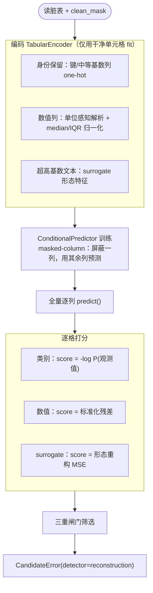
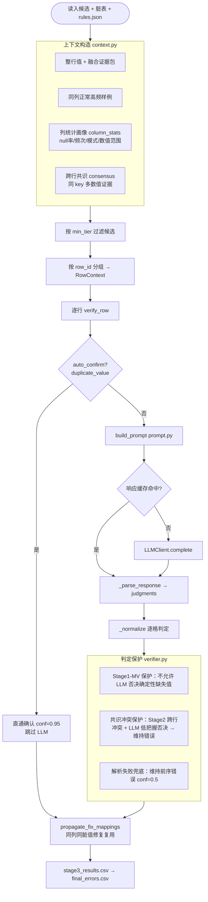

# 表格数据错误检测模型 — 模型概述

本文档介绍本项目的**三阶段表格数据错误检测模型**：整体框架、各阶段职责、输入输出、内部组成及协作关系。读者无需阅读源码即可理解模型如何工作。文档与当前代码保持一致。

---

## 1. 问题定义与设计思想

### 1.1 任务

给定一张**脏表**（CSV，每格为字符串），模型逐单元格检测是否存在数据错误，并输出：

- 错误位置（`row_id`, `column`）
- 错误类型（MV / DMV / FI / T / VAD / DIST / OTHER / NONE）
- 置信度与修复建议（`suggested_fix`）

评估时以同结构的**干净表**（`data/{dataset}_clean.csv`）与脏表逐格对比作为 ground truth。

### 1.2 三层漏斗架构

模型采用**三层漏斗**：逐层放宽检测条件以提召回，最后一层收紧输出以保精度。

| 层级 | 名称 | 检测范式 | 核心目标 |
|------|------|----------|----------|
| Stage 1 | 规则层 | 显式规则 + 统计 + LLM 辅助归纳 + 高精度/确定性检测器 | 高精度检出**可写成规则或确定可判**的错误 |
| Stage 2 | 多检测器候选层 | 多检测器并行 + 证据融合 + 置信度分层 | 高召回补盲点：分布 / 拼写 / 依赖 / 近邻 / 聚类异常 |
| Stage 3 | LLM 精检层 | 融合证据包语义推理 + 统计画像 | **确认**、**分类**、**过滤误报**、**标准化修复** |

**职责边界（去重设计）：** 为避免重复检测，Typo、主导格式偏离、近似函数依赖（FD）等"软/统计型"判定统一归入 Stage 2 多检测器层；Stage 1 只承担高精度规则与确定性结构错误，并保留一个**极端统计兜底**（只捞确凿极端值）。同一 `(row_id, column)` 在多个检测器命中时，由证据融合自然增强可疑分，而非产生重复记录。



**设计原则：**

1. **先规则后分布**：Stage 1 用高置信、可解释的规则与确定性检测覆盖明确错误；Stage 2 在干净子集上学条件分布与多检测器统计，捕获软异常。
2. **前序召回、末级精检**：Stage 1/2 尽量多地召回可疑格；Stage 3 用 LLM 结合整行上下文与融合证据做最终裁决，化解误报。
3. **去重贯穿**：`(row_id, column)` 为单元格唯一键。Stage 1 内部已标记的格不再被后续检测器重复报出；Stage 1 与 Stage 2 之间由证据融合按单元格聚合，Stage 1 证据优先。

---

## 2. 错误类型体系

各阶段产出不同类型，Stage 3 将前序类型统一为可交付的最终类型。

| 类型 | 全称 / 含义 | 主要检出阶段 | 典型场景 |
|------|-------------|--------------|----------|
| **MV** | Missing Value，缺失值 | Stage 1 | 空串、NaN、`empty` 等哨兵出现在不可空列 |
| **DMV** | Dummy Missing Value，伪缺失值 | Stage 1 | 非空但语义缺失：`?`、`unknown`、`missing`、`n.a.` |
| **FI** | Format Inconsistency，格式/类型不一致 | Stage 1 + Stage 2 | 正则不符、长度/范围越界、枚举非法、逻辑类型不符、元数据泄漏、列对调、重复值、极端统计离群（Stage 1）；格式簇偏离 `format_cluster`（Stage 2） |
| **T** | Typo，拼写错误 | Stage 2（`categorical_typo`） | 低频拼写值相对高频锚点（编辑距离 / rapidfuzz 相似） |
| **VAD** | Value Against Dependency，跨列依赖违反 | Stage 2（`approx_fd` / `association_rule` / `neighbor`） | ZipCode↔City 不匹配、近似函数依赖违反、键→值冲突 |
| **DIST** | Distribution anomaly，分布异常 | Stage 2（`reconstruction` / `statistical` / `clustering` / `neighbor`） | 条件概率极低、数值残差过大、统计离群、形态重构误差高 |
| **OTHER** | 其他语义错误 | Stage 3 | LLM 判为错误但无法归入上述类别 |
| **NONE** | 非错误（误报否决） | Stage 3 | 前序候选经 LLM 判为合法值，不进入最终结果 |

**Stage 3 类型映射：**

| 前序类型 | LLM 可输出的最终类型 |
|----------|---------------------|
| MV / DMV / FI / T / VAD | 维持原类型或修正 |
| DIST | VAD / FI / DMV / OTHER / **NONE** |
| NONE | 不写入 `final_errors.csv` |

---

## 3. 整体数据流



**运行顺序（必须按序执行）：**

```powershell
python main.py --input data/hospital_dirty.csv          # Stage 1
python -m stage_2.cli --input data/hospital_dirty.csv   # Stage 2
python -m stage_3.cli --input data/hospital_dirty.csv   # Stage 3
```

**目录约定：** 原始数据在 `data/`；生成物在 `output/mask|stage1|stage2|stage3/`；LLM 缓存在 `cache/`。路径由 `--input` 自动推导，详见 `paths/layout.py`。

---

## 4. Stage 1 — 规则层

### 4.1 阶段功能

Stage 1 是流水线的**第一道关卡**，负责检出能用**明确规则或确定性方法**描述的错误。特点是精度高、可解释、规则可缓存（LLM 仅用于规则归纳与少量语义确认，不逐格调用）。

**擅长：** 格式明确可规则化的错误；缺失值与伪缺失值；逻辑类型不符；确定性结构错误（列对调 / 重复值 / 元数据泄漏 / 不一致表示）；极端数值/日期离群。

**不擅长：** 软统计型跨列异常；数值离群但仍在合法范围内；难以写成规则的语义错误（交由 Stage 2/3）。

### 4.2 输入与输出

| 方向 | 路径 / 来源 | 说明 |
|------|-------------|------|
| **输入** | `data/{dataset}_dirty.csv` | 待检测脏表 |
| **输入** | `configs/default.yaml` | 规则执行、各检测器开关与阈值 |
| **输入** | `.env` | LLM API 密钥与模型配置 |
| **输出** | `output/stage1/{dataset}_errors.csv` | 检出的错误单元格列表 |
| **输出** | `output/stage1/{dataset}_rules.json` | 每列归纳规则与 `semantic_type`（供 Stage 2/3） |
| **输出** | `output/mask/{dataset}_clean_mask.csv` | 布尔掩码，`True`=干净（**Stage 2 训练必需**） |
| **缓存** | `cache/rule_cache.json` | 列画像 MD5 → LLM 归纳规则 / 标准化规格 / 列对确认 |

**errors.csv 核心字段：**

| 字段 | 说明 |
|------|------|
| `row_id, column, value` | 错误位置与当前值 |
| `error_type` | MV / DMV / FI（T/VAD 已迁至 Stage 2） |
| `violated_rule` | 触发的规则类型（如 `regex` / `missing_value` / `extreme_outlier` / `column_swap` / `range_error`） |
| `reason` | 人类可读原因 |
| `suggested_fix, confidence` | 修复建议与置信度（部分检测器填写，规则类多为空） |

### 4.3 内部组成

Stage 1 由**逐列规则流水线**与**列循环后的全局检测器**两部分组成，按"字符/值级 → 列级格式/类型 → 跨列依赖 → 统计兜底"排序。



#### 4.3.1 逐列规则流水线

| 序号 | 模块 | 作用 |
|------|------|------|
| ① | `profiling.py` | 统计列画像：空值率、模式分布、数值统计、字符集、边界样例（不调 LLM） |
| ② | `rule_cache.py` | 以列画像 MD5 为键缓存 LLM 结果，避免重复调用 |
| ③ | `llm_rules.py` | 调用 LLM 从画像归纳列规则（regex / length / value_set / numeric_range 等）及 `logical_type`、`semantic_type` |
| ④ | `rule_guard.py` | 对自由文本/高多样性列丢弃过严 regex，降低误报 |
| ⑤ | `_build_type_rule` | 由 `logical_type`（bool/int/float/date）派生类型一致性规则 → FI |
| ⑥ | `rule_compiler.py` | 将 JSON 规则编译为可执行的 `f(value) → (error_type, rule) \| None` |
| ⑦ | `filter_bad_rules` | 违反率超过 `max_violation_rate`（默认 30%）的规则丢弃 |
| ⑧ | 单元格执行 | 不可空列先扫 MV；再按保留规则顺序执行，**首条违反即停止**；结果记入 `flagged_cells` |

#### 4.3.2 列循环后全局检测器

| 序号 | 模块 | 错误类型 | 默认 | 作用 |
|------|------|----------|------|------|
| ⑨ | `dmv_detect.py` | DMV | 开 | 词表匹配识别语义缺失占位值（`?` / `unknown` / `missing` 等） |
| ⑩ | `standardize_detect.py` | FI | 开 | LLM 归纳列内规范表示形态，标记与多数派不一致的取值 |
| ⑪ | `leakage_detect.py` | FI/metadata_leakage | 开 | 识别 RIS/MEDLINE/PubMed 标签混入字段值，长度离群门控降误报 |
| ⑫ | `dup_detect.py` | FI/duplicate_value | 开 | 整值由同一 token 重复拼接（如 `X,X`）的冗余复制 |
| ⑬ | `range_detect.py` | FI/range_error | 开 | 按 `semantic_type` 施加 age/percentage/price/lat/lon/year 等硬范围 |
| ⑭ | `xcol_detect.py` | FI/column_swap | 开（需 LLM） | 统计发现"全名↔标准缩写"列对，LLM 语义确认后标记对调行 |
| ⑮ | `detect_statistical`（复用 stage_2） | FI/extreme_outlier | 开 | 数值/日期列 Robust-Z(>6) + IQR(k=4.5) 双判据，只捞确凿极端值 |
| — | `iforest_detect.py` | FI/extreme_outlier | 关 | 数值列联合 IsolationForest top 分位 + 逐列 robust-z 定位（可选） |
| — | `arith_rules.py` | FI/arithmetic_constraint | 关 | LLM 归纳跨列算术约束 → AST 安全求值 → support/violation 验证（可选） |

> 已迁出 Stage 1（并入 Stage 2 多检测器层，消除重复检测）：Typo（→ `categorical_typo`）、主导格式偏离（→ `format_cluster`）、近似函数依赖 FD（→ `approx_fd`，默认 LLM 语义校验）。
> `iforest` 与 `arith` 默认关闭，可在 `configs/default.yaml` 的 `execution.iforest / execution.arith` 开启。
> `arith_rules.compile_arith` 用 `ast.walk` 白名单校验（仅允许数字/列名/`+ - * / % **`/比较/and-or-not/`abs|min|max|round`），其余节点抛 `UnsafeExpression`，杜绝注入。

#### 4.3.3 辅助机制

| 机制 | 说明 |
|------|------|
| `flagged_cells` 去重 | `(row_id, column)` 集合贯穿全流程；已标记格跳过后续检测 |
| `build_clean_mask` | 以 errors 取反生成与表同形的布尔掩码，供 Stage 2 训练 |
| 可空列推断 | `nullable_columns` 显式配置，或 `infer_nullable` 据 LLM 无 `not_null` + 高空值率推断 |
| 配置开关 | 各检测器均可通过 `configs/default.yaml` 的 `execution.*` 段独立启停 |

**入口：** `python main.py` → `stage_1.cli.main()` → `run_rule_layer()`（`stage_1/executor.py`）

---

## 5. Stage 2 — 多检测器候选层

### 5.1 阶段功能

Stage 2 在 Stage 1 标记的**干净子集**上学习各列分布与统计特征，对**全量数据**运行一组检测器，召回规则层漏掉的可疑单元格，再将多检测器证据按 `(row_id, column)` **加权融合**为统一可疑分与置信度分层。

**核心思想：** 不同检测器从互补视角发现异常——条件预测看"该值能否由其余列预测"，统计看"是否偏离列分布"，类别看"是否罕见拼写/格式"，近邻/FD/关联看"是否违反跨列一致性"。多检测器一致命中同一格时，融合分自然升高。

完全**无监督**，不依赖 ground truth。除 FD 的可选 LLM 语义校验外，检测过程不调用 LLM。

**擅长：** Stage 1 漏掉的类别 typo / 未知枚举；数值与日期离群；多来源键→值冲突；近似函数依赖违反。

**不擅长：** 天然无强共识的列；标识列（由可预测性闸门跳过）；单独精度低于 Stage 1，误报交 Stage 3 过滤。

### 5.2 输入与输出

| 方向 | 路径 / 来源 | 说明 |
|------|-------------|------|
| **输入** | `data/{dataset}_dirty.csv` | 待检测脏表（全量打分） |
| **输入** | `output/mask/{dataset}_clean_mask.csv` | Stage 1 干净掩码（**训练/估参必需**） |
| **输入** | `output/stage1/{dataset}_errors.csv` | 与 Stage 2 候选融合 |
| **输入** | `output/stage1/{dataset}_rules.json` | 列 `semantic_type`（供 range/statistical 等检测器） |
| **输入** | `.env` | 仅 `approx_fd` 语义校验需要；无密钥则自动退化为纯统计 |
| **输出** | `output/stage2/{dataset}_stage2_candidates.csv` | 各检测器候选并集（统一 `CandidateError` schema） |
| **输出** | `output/stage2/{dataset}_combined_candidates.csv` | Stage1 ∪ Stage2 证据融合结果（**Stage 3 输入**） |

**stage2_candidates.csv 字段（`stage_2/schema.py`）：** `row_id, column, value, detector, error_type, anomaly_score, evidence, suggested_fix, subtype`。

**combined_candidates.csv 字段（证据融合，`stage_2/fusion.py`）：**

| 字段 | 说明 |
|------|------|
| `source` | `stage1` 或 `stage2`（同格 Stage 1 证据优先） |
| `detectors` | 命中该格的检测器名列表（逗号分隔） |
| `suspicion_score` | 加权融合可疑分 `S = 1 - ∏(1 - w·s)` |
| `confidence_tier` | `high`(≥0.85) / `mid`(≥0.6) / `low` |
| `evidence` | 各检测器证据汇总文本 |
| `candidate_fixes` | 各检测器候选修复值汇总 |
| `error_type, violated_rule, reason, suggested_fix, anomaly_score, subtype` | 保留主证据原字段（向后兼容 Stage 3） |

### 5.3 检测器清单

各检测器统一输出 `CandidateError`（`stage_2/detectors/`），共享 `DetectorContext`（`detectors/base.py`，携带列类型 `kinds`、`semantic_types`、已 fit 的编码器与张量，避免重复计算）。

| 配置开关 | 默认 | 输出 detector 名 | error_type | 机制 |
|----------|------|------------------|------------|------|
| `reconstruction` | 开 | `reconstruction` | DIST | 条件预测 `P(列\|其余列)` 自监督重构打分（见 §5.5） |
| `statistical` | 开 | `statistical` | DIST | 数值 Robust-Z + IQR 双判据；日期解析后 Robust-Z |
| `categorical` | 开 | `categorical_typo` / `format_cluster` | T / FI | 低频值 + rapidfuzz 拼写相似（T）；罕见字符/格式簇偏离（FI） |
| `neighbor` | 开 | `neighbor_consistency` | DIST / VAD | sklearn KNN 在干净行建邻域，数值偏离 / 类别多数 |
| `fd` | 开 | `approx_fd` | VAD | 复用 `stage_1.fd_detect` 统计挖掘，默认 LLM 语义校验（无 LLM 退化为纯统计） |
| `association` | 关 | `association_rule` | VAD | 单前件关联规则 (A=a)⇒(B=b)，support/confidence/lift 门控 |
| `clustering` | 关 | `clustering` | DIST | LOF 行级离群 + 逐列 robust-z/低频定位（低权重） |

**CLI 开关：** `--all-detectors` 一键全开；`--detectors a,b,c` 显式选择子集（覆盖默认）。FD 语义校验所需 LLM 由 `stage_2/cli.py:_maybe_build_llm()` 注入（复用 Stage 1 `.env`），无密钥时打印提示并退化。

### 5.4 证据融合与置信度分层（`stage_2/fusion.py`）

`merge_candidates()` 调用 `fuse_candidates()`，按 `(row_id, column)` 聚合 Stage 1 与 Stage 2 全部证据：

1. **归一化**：软检测器（`reconstruction / statistical / neighbor_consistency / clustering`）原始分是 z-score/-logP 等无界量，按 detector 内分位归一化到 [0,1]；规则/硬检测器用其置信度（缺失/NaN/≤0 → 默认 0.9）。
2. **加权融合**：`S = 1 - ∏_d (1 - w_d · s_d)`，每检测器取其最强证据；多检测器一致时 S 升高。
3. **分层**：`high ≥ 0.85` / `mid ≥ 0.6` / `low`（<0.4 仍记 low，**不丢弃以保召回**）。
4. **主证据**：Stage 1 证据优先作主证据（决定 `error_type/violated_rule/suggested_fix`）；`anomaly_score/subtype` 优先取 `reconstruction`（供 Stage 3 共识保护）。

**检测器权重（`_WEIGHTS`）：** `strong_rule=1.0`、`approx_fd/fd=0.9`、`reconstruction=0.85`、`association_rule/categorical_typo/typo=0.8`、`neighbor_consistency=0.75`、`statistical/format_cluster=0.6`、`clustering=0.4`，未列出默认 0.6。

> Stage 1 错误映射到融合 detector 名：`error_type=T → typo`；`violated_rule` 以 `fd:` 开头或 `error_type=VAD → approx_fd`；其余 → `strong_rule`。当前 Stage 1 不再产出 T/VAD，故其证据基本为 `strong_rule`（权重 1.0）。

### 5.5 reconstruction 检测器（条件预测重构）

`reconstruction` 是默认开启、最复杂的检测器，沿用原 Stage 2 条件预测模型。



| 模块 | 文件 | 作用 |
|------|------|------|
| **表格编码** | `encoding.py` | `TabularEncoder`：表格转数值张量；身份保留 one-hot（键/中等基数列）；数值列单位感知解析；超高基数文本走 surrogate；输出逐列 `ColumnSpec` |
| **条件预测模型** | `model.py` | `ConditionalPredictor`：共享编码器 + 逐列预测头；masked-column 训练（屏蔽目标列，用其余列预测） |
| **打分与编排** | `score.py` | 逐格似然/残差计算；三重闸门；`run_stage2()` 编排全部检测器并汇集候选 |
| **列类型/语义** | `coltypes.py` | 列类型推断（numeric/categorical/id/highcard）、robust 统计、从 rules.json 读 `semantic_type` |
| **IO 与合并** | `io_utils.py` | 表格/掩码读取；`merge_candidates` → `fuse_candidates` 融合 |

**打分逻辑与三重闸门：**

| 列类型 | 分数 | 可疑判定 |
|--------|------|----------|
| 类别 | `-log P(观测值 \| 其余列)` | 分数 > 干净分位阈值，**或** `P(观测) < abs_prob_floor` |
| 数值 | `\|预测 - 观测\|` 标准化残差 | 分数 > 干净分位阈值 |
| surrogate | 形态特征重构 MSE | 分数 > 干净分位阈值 |

| 闸门 | 参数 | 作用 |
|------|------|------|
| 分位阈值 | `quantile` | 逐列在干净分数分布上取高分位，无监督自适应 |
| 精度闸门 | `margin` | 类别列仅当模型偏好的替代类概率显著高于观测值才报，并给出 `suggested_fix` |
| 可预测性闸门 | `min_predictability` | 跳过难以由上下文预测的标识列，控误报 |

**训练约束：** 仅在 `clean_mask` 干净单元格上拟合编码器与模型；推断时对全量行（含脏行）打分以发现漏报。可选 `--masked-inference` 在预测时中性化已确认脏的上下文，隔离脏上下文传播。

### 5.6 消融实验

`python -m stage_2.ablation --dirty data/{dataset}_dirty.csv`：一次训练 reconstruction 并各检测器各跑一次，再按检测器子集组合（含留一法）对比合并集 cell-level P/R/F1，量化各检测器边际贡献。

**入口：** `python -m stage_2.cli` → `run_stage2()`（`stage_2/score.py`）

---

## 6. Stage 3 — LLM 精检层

### 6.1 阶段功能

Stage 3 对 Stage 1 ∪ Stage 2 融合后的**可疑候选**做语义级精检。LLM 结合整行上下文、列语义类型、同列正常样例、统计画像与**多检测器融合证据**，完成：

1. **确认**是否为真错误（`is_error`）
2. **修正**错误类型（如 DIST → VAD / FI / NONE）
3. **过滤**误报（判为 NONE 的不进入最终结果）
4. **输出**标准化修复建议（`suggested_fix`）

**擅长：** 化解 Stage 2 分布误报；识别派生列语义；跨列一致性判断；给出可解释的 `llm_reason`。

**不擅长：** 完全未被前序召回的错误；依赖 LLM API 成本与稳定性。

### 6.2 输入与输出

| 方向 | 路径 / 来源 | 说明 |
|------|-------------|------|
| **输入** | `data/{dataset}_dirty.csv` | 原始脏表（取整行上下文） |
| **输入** | `output/stage2/{dataset}_combined_candidates.csv` | Stage1 ∪ Stage2 融合候选 |
| **输入** | `output/stage1/{dataset}_rules.json` | 列 `semantic_type` |
| **输入** | `.env` | LLM API 配置 |
| **输出** | `output/stage3/{dataset}_stage3_results.csv` | 逐格判定明细（含 LLM 推理过程） |
| **输出** | `output/stage3/{dataset}_final_errors.csv` | **最终确认错误**（`is_error=True`） |
| **缓存** | `cache/stage3_cache.json` | 相同 prompt 的 LLM 响应缓存 |

**stage3_results.csv 字段：** `row_id, column, value, prior_error_type, prior_source, is_error, error_type, confidence, suggested_fix, fix_source, fix_confidence, llm_reason`。

**final_errors.csv 字段：** `row_id, column, error_type, confidence, suggested_fix, fix_source, fix_confidence`，其中 `fix_source ∈ {llm, consensus, prior, prior_rule, propagated}`。

**融合证据包：** prompt 注入 `multi_detector_evidence`（`detectors / suspicion_score / confidence_tier / evidence / candidate_fixes`），多检测器一致指向同格时提高判错把握。`--min-tier {low,mid,high}` 仅精检 ≥ 指定层级的候选，权衡召回与 LLM 成本。

### 6.3 内部组成



| 模块 | 文件 | 作用 |
|------|------|------|
| **上下文构造** | `context.py` | 读候选并按 `min_tier` 过滤、按 `row_id` 分组；构造 `RowContext`/`SuspectCell`（含融合证据）；计算正常样例、列统计、跨行共识；标记 `auto_confirm` |
| **Prompt 渲染** | `prompt.py` | 组装精检 prompt：整行 JSON + 可疑格 + 多检测器证据 + 正常样例 + 列统计 + 跨行共识 |
| **LLM 精检** | `verifier.py` | 逐行调用 LLM（或直通确认）；解析 JSON 判定；应用保护机制；`propagate_fix_mappings` 修复复用 |
| **响应缓存** | `cache.py` | 以 prompt 文本为键缓存 LLM 响应，原子写入防截断 |
| **评估** | `evaluate.py` | 精检前（合并候选）vs 精检后（最终确认）P/R/F1，含 correction-level 与按类型分项 |

#### 6.3.1 判定保护机制

| 保护 | 触发条件 | 行为 |
|------|----------|------|
| **确定性结构错误直通** | `violated_rule ∈ {duplicate_value}` | 直接确认（conf=0.95），跳过 LLM；整行皆此类则整行跳过 LLM |
| **Stage1-MV 保护** | `prior_source=stage1` 且 `prior_error_type=MV`，LLM 判 NONE | 维持为错误（可 `--no-protect-mv` 关闭） |
| **共识冲突保护** | `prior_source=stage2` 且跨行共识冲突，LLM 低把握（< `reject_conf_threshold`，默认 0.85）判 NONE | 维持为错误，补 `suggested_fix=majority_value` |
| **解析失败兜底** | LLM 未返回该格判定 | 维持前序错误，conf=0.5 |

> `format_outlier` 随主导格式检测迁出 Stage 1，不再属于自动确认集合，改走融合 + LLM 复核。

#### 6.3.2 修复映射复用

`propagate_fix_mappings`：LLM 对某列某脏值给出 `old→new` 修复后，自动将同列同脏值的修复补全到其他未获 LLM 判定的候选格（`fix_source=propagated`）。

**入口：** `python -m stage_3.cli` → `verify_contexts()`（`stage_3/verifier.py`）

---

## 7. 三阶段协作关系

### 7.1 维度对比

| 维度 | Stage 1 | Stage 2 | Stage 3 |
|------|---------|---------|---------|
| 检测范式 | 规则 + 统计 + LLM 辅助归纳 | 多检测器并行 + 证据融合 | LLM 语义推理 + 统计画像 |
| 主要目标 | 高精度召回明确错误 | 高召回补规则层盲点 | 确认、分类、过滤误报、标准化修复 |
| 产出错误类型 | MV / DMV / FI | DIST / T / VAD（融合后保留主证据类型） | 维持前序或细化为 VAD/FI/DMV/OTHER/NONE |
| 可解释性 | 高（规则、reason） | 中（anomaly_score、subtype、evidence） | 高（llm_reason、suggested_fix） |
| LLM 使用 | 规则归纳 + 列对/标准化确认（按列，可缓存） | 仅 approx_fd 语义校验（可退化） | 逐行精检（可缓存） |
| 精度倾向 | 高 P | 中等 P，补召回 | 提升最终 P，输出可交付结果 |

### 7.2 数据依赖链

```
Stage 1 ──→ clean_mask ──→ Stage 2 训练/估参
         ──→ errors ──────→ Stage 2 证据融合
         ──→ rules.json ──→ Stage 2 语义类型 + Stage 3 prompt

Stage 2 ──→ combined_candidates ──→ Stage 3 输入

Stage 3 ──→ final_errors.csv（最终交付物）
```

**关键约束：**

- Stage 1 **必须先运行**（产出 `clean_mask` 与 `errors`）
- Stage 2 依赖 Stage 1 的 `clean_mask` 估参、`errors` 融合、`rules.json` 取语义类型
- Stage 3 依赖 Stage 2 的 `combined_candidates` 与 Stage 1 的 `rules.json`
- 评估需 `data/{dataset}_clean.csv` 作为 ground truth

### 7.3 输出字段演进

| 阶段 | 新增核心字段 |
|------|-------------|
| Stage 1 | `error_type, violated_rule, reason` |
| Stage 2 候选 | `detector, anomaly_score, evidence, subtype` |
| 融合后 | `source, detectors, suspicion_score, confidence_tier, evidence, candidate_fixes` |
| Stage 3 明细 | `prior_*, is_error, confidence, fix_source, fix_confidence, llm_reason` |
| 最终输出 | `row_id, column, error_type, confidence, suggested_fix, fix_source, fix_confidence` |

---

## 8. 评估

评估以 clean vs dirty 逐格差异为 ground truth：

```powershell
python -m stage_2.evaluate --dirty data/hospital_dirty.csv   # Stage1 / Stage2 / 合并
python -m stage_3.evaluate --dirty data/hospital_dirty.csv   # 精检前 vs 精检后
```

| 评估脚本 | 对比对象 |
|----------|----------|
| `stage_2.evaluate` | Stage 1 / Stage 2 / 合并 S1∪S2 的 cell-level、分组、**row-level** P/R/F1 |
| `stage_3.evaluate` | 精检前 vs 精检后 P/R/F1；**correction-level** 修复准确率；**按 error_type 分项**；按列误报化解 Top-N |
| `stage_2.ablation` | 各检测器子集组合（含留一法）对合并集 P/R/F1 的边际贡献 |

---

## 9. 代码入口速查

| 阶段 | CLI 命令 | 核心函数 | 配置 |
|------|----------|----------|------|
| Stage 1 | `python main.py --input data/{dataset}_dirty.csv` | `run_rule_layer()` | `configs/default.yaml` |
| Stage 2 | `python -m stage_2.cli --input data/{dataset}_dirty.csv [--all-detectors\|--detectors ...]` | `run_stage2()` | `stage_2/config.py` |
| Stage 3 | `python -m stage_3.cli --input data/{dataset}_dirty.csv [--min-tier mid]` | `verify_contexts()` | `stage_3/config.py` |

**依赖：** 见 `requirements.txt`（含 `scikit-learn>=1.2`、`rapidfuzz>=3.0`；reconstruction 需 `torch>=2.0`）。

**Stage 3 建议用法：** 先 `--dry-run --limit 3` 确认 prompt，再全量运行；可用 `--limit N` 小规模试跑、`--min-tier` 控 LLM 成本。

---

## 附录：可选的单轮回灌工具

主流程中 `clean_mask` 仅由 Stage 1 errors 取反构建。可选工具 `stage_2/refine_mask.py` + `run_feedback.py` 支持将 Stage 3 高置信判定回灌掩码后重训 Stage 2，用于提纯训练分布；`stage_2/vocab_denoise.py` 用编辑距离自过滤剔除混入类别词表的漏报 typo。该类功能**未接入主流程**，按需使用。
