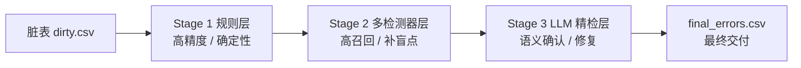
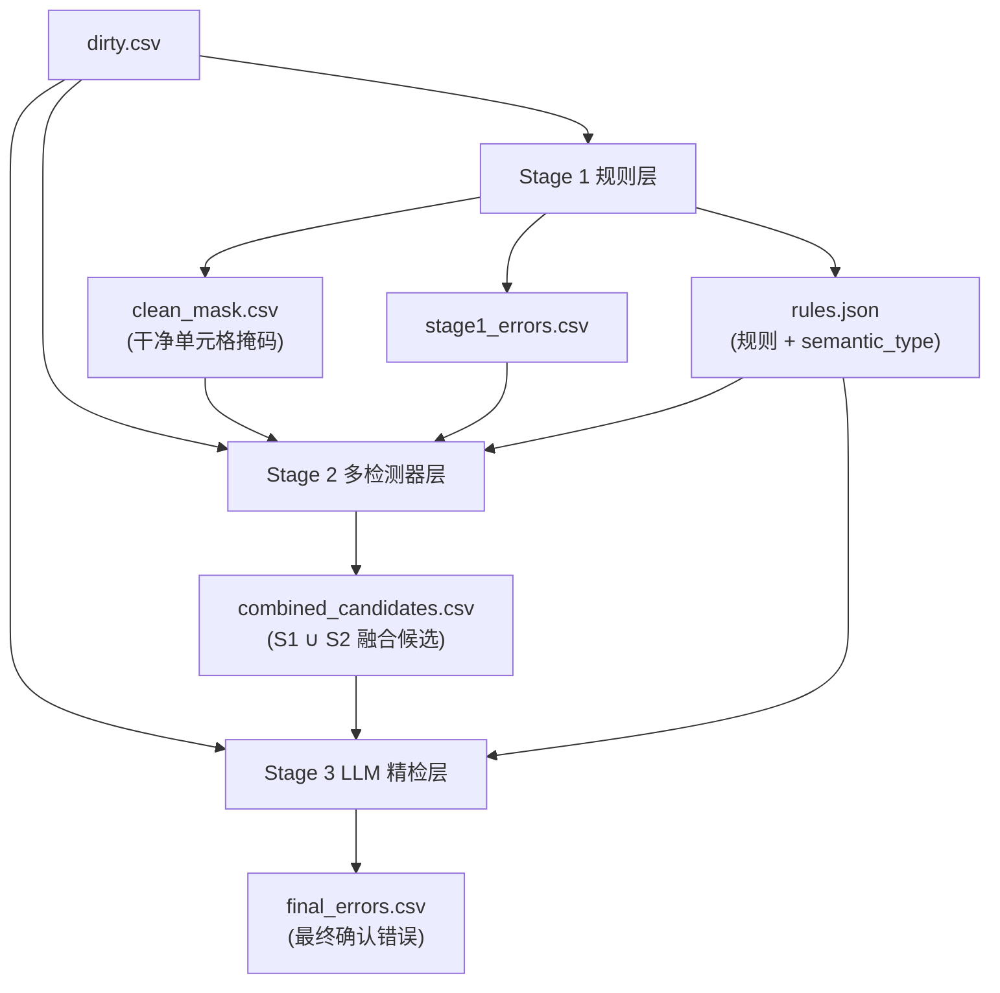

# 基于大语言模型的漏斗式错误检测框架概述

本文档概述本项目提出的**基于大语言模型（LLM）的漏斗式表格数据错误检测框架**。
框架将「规则筑底 → 多检测器补漏 → 语义精检」组织为一条逐层收敛的漏斗式流水线，在保证精度的同时提升召回，并借助 LLM 完成规则归纳、语义校验与逐格修复。

---

## 1. 框架总览

### 1.1 任务定义

给定一张脏表 `data/{dataset}_dirty.csv`，逐单元格判定其是否为错误，并给出：

- **错误位置**：`row_id`、`column`
- **错误类型**：`MV / DMV / FI / T / VAD / DIST / OTHER / NONE`
- **证据与分数**：`reason / anomaly_score / suspicion_score / confidence_tier`
- **修复建议**：`suggested_fix`（含来源与置信度）

评估时以 `data/{dataset}_clean.csv` 与脏表逐格差异作为 ground truth。

### 1.2 错误类型体系

| 代码 | 含义 | 主要负责阶段 |
|------|------|--------------|
| `MV` | 缺失值 | Stage 1 |
| `DMV` | 伪缺失值（`?`、`unknown` 等占位） | Stage 1 |
| `FI` | 格式 / 类型 / 结构不一致 | Stage 1 / Stage 2 |
| `T` | 拼写错误（Typo） | Stage 2 |
| `VAD` | 值域 / 跨列依赖 / 共识违反 | Stage 2（含 Stage 1 确定性 VAD） |
| `DIST` | 分布 / 上下文异常 | Stage 2 |
| `OTHER` | 其他语义错误 | Stage 3 归类 |
| `NONE` | 精检后判定为非错误（误报） | Stage 3 |

### 1.3 漏斗三层分工

框架的核心思想是**精度—召回—语义逐层收敛**：每一层解决上一层难以覆盖的问题，并把可靠知识向下传递。

- **Stage 1 规则层**：高精度、可解释，优先检出确定性错误，为整体筑底
- **Stage 2 多检测器候选层**：高召回，补 Stage 1 的盲点，输出带证据的融合候选
- **Stage 3 LLM 精检层**：语义确认、过滤误报、统一错误类型与修复建议，产出最终交付结果

### 1.4 LLM 在框架中的三种角色

LLM 贯穿三层，但每层承担不同职责，且**始终不直接决定确定性错误的最终去留**：

- **Stage 1（归纳者）**：为每列归纳可执行的校验规则与标准化规格，交由确定性代码执行
- **Stage 2（语义校验者）**：对统计挖掘出的函数依赖、列对调等候选做语义确认，过滤伪关系
- **Stage 3（精检者）**：基于结构化证据包逐格判定真伪、修正类型并给出标准化修复

### 1.5 阶段间知识传递

漏斗各层并非孤立运行，而是通过标准化产物传递知识，形成一条完整的数据流：

关键传递物：

- **`clean_mask.csv`**：Stage 1 标记的「未被判错」单元格，作为 Stage 2 无监督估参与模型训练的干净子集
- **`rules.json`**：每列规则与 `semantic_type`，为 Stage 2/3 提供列语义先验
- **`combined_candidates.csv`**：Stage 1∪Stage 2 融合后的候选，携带 `suspicion_score`、`confidence_tier`、多检测器证据与候选修复，供 Stage 3 消费

---

## 2. Stage 1：规则层

### 2.1 输入输出

- **输入**：脏表 CSV（以字符串读取，避免空串被自动转为 NaN）、YAML 配置（LLM 与各检测器开关/阈值）
- **输出**：
  - `stage1_errors.csv`：错误单元格（统一 schema：`row_id, column, value, error_type, violated_rule, reason, suggested_fix, confidence`）
  - `rules.json`：每列保留规则与 `semantic_type`、语义备注
  - `clean_mask.csv`：与脏表同形状的布尔掩码，`True` 表示未被任何检测器标记（供 Stage 2 训练）

### 2.2 功能

以「LLM 归纳规则 + 确定性检测器」混合执行：

1. **逐列画像**：纯统计生成紧凑画像（空值率、样例值、长度/数值统计、观测模式、字符集、边缘样例）
2. **规则归纳**：将画像喂给 LLM，归纳 `regex / value_set / length / numeric_range / not_null` 等规则及 `semantic_type`（命中缓存则复用）
3. **规则过滤与编译**：规则守卫（丢弃自由文本上的过严正则）→ 编译为确定性函数 → 按违反率上限丢弃过拟合规则
4. **逐格执行**：非可空列优先扫描缺失值（MV），随后命中第一条违反规则即记录并停止
5. **全局检测器链**（跳过已标记单元格）：伪缺失（DMV）、标准化不一致（FI）、元数据泄漏（FI）、重复拼接值（FI）、语义硬范围（FI）、跨列对调（FI，含可选 LLM 语义确认）、极端统计离群（FI）；可选孤立森林、跨列算术约束（默认关闭）

### 2.3 优势

- **高精度、可解释**：每条错误都携带违反的规则名与理由，便于审计
- **多层误报防护**：Prompt 引导「宁可偏松」→ 规则守卫 → 高违反率规则丢弃，三道闸门抑制 LLM 过拟合脏数据
- **LLM 与执行解耦**：LLM 只负责归纳，执行由编译后的确定性函数完成，结果稳定可复现
- **缓存复用**：以列画像哈希为键缓存 LLM 结果，重复运行零额外成本

### 2.4 侧重错误类型

- **MV**：缺失值（独立于 LLM 的 `not_null` 规则，始终扫描缺失哨兵）
- **DMV**：伪缺失值（整值匹配 `?`、`unknown`、`n/a` 等占位词）
- **FI**：格式/类型/结构不一致（正则、长度、类型、标准化、泄漏、重复、硬范围、列对调、极端离群）
- **确定性 VAD**：LLM 明确的合法值域约束

### 2.5 创新点

- **画像驱动的 LLM 规则**：不把全列原始数据喂给 LLM，而是紧凑统计画像 + 边缘样例，降低 token 成本并抑制过拟合
- **确定性执行的规则编译器**：LLM 规则被编译为 Python 判定函数，算术约束经 AST 白名单编译，杜绝注入
- **MV 与规则解耦**：缺失检测不依赖 LLM 是否输出 `not_null`
- **多数派错误检测**：标准化不一致检测刻意绕过违反率上限（错误形态可能是多数派），并用命中率上限防爆
- **干净掩码输出**：主动为下游提供「未污染单元格」子集，使 Stage 2 的无监督估参更可靠

---

## 3. Stage 2：多检测器候选层

### 3.1 输入输出

- **输入**：脏表 + Stage 1 的 `clean_mask`（必需）、`stage1_errors`（用于融合）、`rules.json`（列语义先验）
- **输出**：
  - `stage2_candidates.csv`：各检测器原始候选（`row_id, column, value, detector, error_type, anomaly_score, evidence, suggested_fix, subtype`）
  - `combined_candidates.csv`：Stage 1∪Stage 2 融合候选（新增 `source, detectors, suspicion_score, confidence_tier, evidence, candidate_fixes` 等）

### 3.2 功能

在 Stage 1 的干净掩码上估参/训练，随后在全量数据上并行运行多检测器，最后与 Stage 1 证据融合：

- **干净子集估参**：编码器、统计阈值仅在 `clean_mask==True` 的单元格上学习；条件预测模型仅在「整行干净」的行上训练，避免脏格污染上下文
- **多检测器并行**（默认开：重构 / 统计 / 类别 / 近邻 / FD；默认关：关联规则 / 聚类）
- **融合**：按 `(row_id, column)` 聚合多源证据，加权独立乘积计算可疑度并分层

### 3.3 各检测器一览

| 检测器 | 默认 | 原理 | 侧重错误 |
|--------|------|------|----------|
| 重构（reconstruction） | 开 | 条件预测 `P(列 \| 同行其余列)`，观测概率低/残差大即可疑 | DIST（含键→值冲突） |
| 统计（statistical） | 开 | Robust-Z + IQR 双判据（数值/可解析日期列） | DIST |
| 类别（categorical） | 开 | 低频值与高频锚点相似度判 typo；字符模式占比过低判格式簇 | T / FI |
| 近邻（neighbor） | 开 | KNN 近邻一致性：数值偏离/类别多数不符 | DIST / VAD |
| 函数依赖（fd） | 开 | 统计挖掘近似 FD，可选 LLM 语义校验 | VAD |
| 关联规则（association） | 关 | 单前件高置信关联规则违反 | VAD |
| 聚类（clustering） | 关 | LOF 行级离群后逐列定位 | DIST |

### 3.4 重构检测器（核心）

- **类别列**：`-log P(观测值 | 上下文)`（负对数似然），并取 argmax 类别作为修复建议
- **数值列**：标准化残差
- **高基数字符串**：形态 surrogate 特征的重构误差

判定采用**双闸门 + 绝对概率地板并集**：相对分位阈值（`quantile`）与类别绝对概率地板（`abs_prob_floor`）取并集提升召回，再叠加类别精度闸门（`margin`）与可预测性闸门（`min_predictability`）抑制误报。可选**掩码推理 / 迭代掩码推理**，把 Stage 1 已确认脏的单元格在上下文中中性化，隔离脏上下文传播。

### 3.5 融合策略

- **归一化**：软检测器（重构/统计/近邻/聚类）按 detector 内分位排名归一化，硬/规则检测器直接用置信度
- **加权独立乘积融合**：每格每检测器取最强证据后，`suspicion_score = 1 - ∏(1 - wₐ · sₐ)`，权重按检测器可靠性配置（规则 1.0 > FD 0.9 > 重构 0.85 > …）
- **分层**：`confidence_tier = high(≥0.85) / mid(≥0.60) / low`，`low` 不丢弃以保召回
- **来源与证据**：`source` 标注主证据来自 stage1/stage2；`detectors` 记录命中检测器集合；`evidence` 与 `candidate_fixes` 汇总多源证据与候选修复

### 3.6 优势

- **高召回补盲点**：多检测器互补，覆盖 Stage 1 难以规则化的分布异常、拼写、依赖违反
- **无监督**：不依赖 ground truth，所有阈值从干净掩码估计
- **证据可解释、可配置**：融合权重与分层可调，为 Stage 3 提供结构化证据

### 3.7 侧重错误类型

- **DIST**：分布/上下文异常，包括键→值冲突（如航班号与时刻不符）
- **VAD**：函数依赖/关联规则/近邻共识违反
- **T**：拼写错误
- **FI**：字符模式异常的格式簇

### 3.8 创新点

- **统一条件预测模型**：单一模型同时覆盖分布异常与函数依赖式冲突，无需按数据集切换检测器
- **身份保留编码（identity-preserving）**：保留中等基数键列的身份，使 `P(值 | 键)` 可学，修复键值冲突检测
- **双闸门 + 绝对概率地板并集**：兼顾无监督分位召回与语义明确的低概率召回
- **掩码 / 迭代掩码推理**：隔离已确认脏上下文与同行相互掩护
- **加权独立乘积融合**：多源证据概率式合并，输出可解释的分层可疑度
- **LLM-free 词表去污**：用编辑距离剔除漏报 typo 对训练词表的污染

---

## 4. Stage 3：LLM 精检层

### 4.1 输入输出

- **输入**：脏表 + `combined_candidates.csv`（融合候选）+ `rules.json`（列语义类型）
- **输出**：
  - `stage3_results.csv`：全部候选格的逐格判定（含被否决的误报，字段含 `is_error, error_type, confidence, suggested_fix, fix_source, fix_confidence, llm_reason` 等）
  - `final_errors.csv`：`is_error=True` 的子集，作为最终交付的错误列表

### 4.2 功能

对候选格逐个完成四类精检任务，并按行分组以一次 LLM 调用处理同一行的多个可疑格：

1. **真伪判定**（`is_error`）：确认或否决
2. **类型修正**：如 `DIST → VAD / FI / OTHER / NONE`
3. **误报否决**：`NONE` 不进入最终输出
4. **修复标准化**：给出标准化的 `suggested_fix`，并记录来源与置信度

### 4.3 证据包上下文工程

Stage 3 不是重新检测，而是基于为每个候选构建的**结构化证据包**做语义裁决：

- **整行值**：支持跨列一致性判断（如 city/state/zip）
- **同列正常样例 + 列统计画像**：空值率、高频值、主导模式、数值范围，支撑分布级判断
- **跨行共识**：自动探测 key 列，对同 key 多记录冲突（如多源时刻）给出多数值与冲突标记
- **多检测器融合证据**：`detectors`、`suspicion_score`、`confidence_tier`、`evidence`、`candidate_fixes`

### 4.4 不对称保护机制

框架奉行「确定性信号不交给 LLM 推翻，模糊边界才用 LLM」的哲学，因此**确认门槛低、否决门槛高**：

- **duplicate_value 直通**：高置信确定性结构错误直接确认，跳过 LLM
- **MV 保护**：Stage 1 确定性缺失值不允许被 LLM 否决
- **共识冲突保护**：Stage 2 共识冲突候选被 LLM 以低把握判 NONE 时驳回，维持为错误
- **解析失败回退**：LLM 未返回某格判定时，保守维持为错误（沿用前序类型与修复）

### 4.5 优势

- **降误报、保召回**：以精检提升 precision，同时用多重保护守住 recall
- **修复闭环**：`propagate_fix_mappings` 复用同 `(column, value)` 的高置信修复，形成一致映射
- **成本可控**：`min-tier` 分层过滤、按行分组调用、Prompt 级缓存，确定性格直通省 token

### 4.6 侧重错误类型

覆盖全部类型的语义确认，尤其擅长：化解误报（判 `NONE`）、修正 Stage 2 的 `DIST` 归类、处理需跨行共识才能判定的冲突。

### 4.7 创新点

- **证据包驱动的上下文工程**：从「单值 + 类型」升级到「整行 + 分布画像 + 跨行共识 + 多检测器融合」的综合裁决
- **跨行共识自动探测 + LLM 协同 + 验证器保护**：针对实体多记录冲突类错误
- **不对称保护策略**：确认可低门槛、否决需高门槛，兼顾精度与召回
- **修复标准化 + 映射传播 + 修复评估**：不仅检错，还度量「是否修对」

---

## 5. 评估体系

框架以 `clean.csv` 与 `dirty.csv` 的逐格差异为 ground truth，从多角度度量有效性：

- **Stage 2 层评估**：Stage 1、Stage 2、合并集的 **cell-level 与 row-level P/R/F1**，并按数值列/类别列分组，验证漏斗前两层的精度—召回权衡
- **Stage 3 层评估**：**精检前（combined）vs 精检后（final）** 的 P/R/F1 对比、**correction-level 修复准确率**、按 `error_type` 的分项精度、按列的误报化解统计

这套评估既衡量「检得准不准」（P/R/F1），也衡量「修得对不对」（correction accuracy），完整覆盖检测—修复闭环。

---

## 6. 框架级创新点小结

1. **漏斗式三层递进架构**：以精度—召回—语义逐层收敛，规则筑底、检测器补漏、LLM 精检，各层职责清晰且互补
2. **LLM 的分层协同**：归纳规则、语义校验、逐格精检三种角色分工，且确定性错误始终不被 LLM 单方面推翻
3. **阶段间知识传递闭环**：`clean_mask`（干净子集）、`rules.json`（列语义）、`combined_candidates`（融合证据）串起三层，下游持续复用上游可靠知识
4. **统一条件预测 + 身份保留编码**：单模型覆盖分布异常与依赖冲突，突破传统按类型切换检测器的局限
5. **多源证据融合与分层**：加权独立乘积可疑度 + 置信分层，为语义精检提供可解释输入
6. **不对称保护 + 证据包精检**：以结构化上下文和「低门槛确认、高门槛否决」实现降误报而不牺牲召回
7. **检测—修复—评估一体化**：修复标准化与映射传播，配合修复准确率评估，形成可度量的完整闭环
