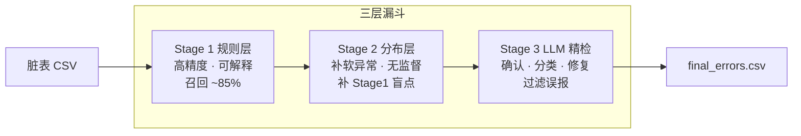
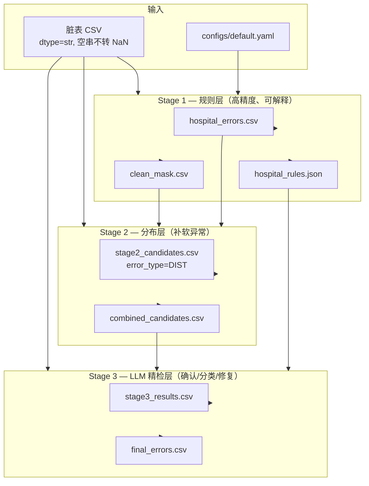
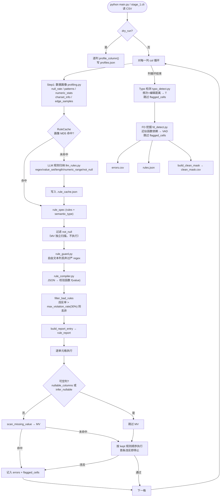
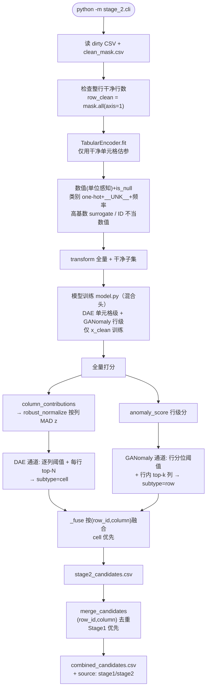
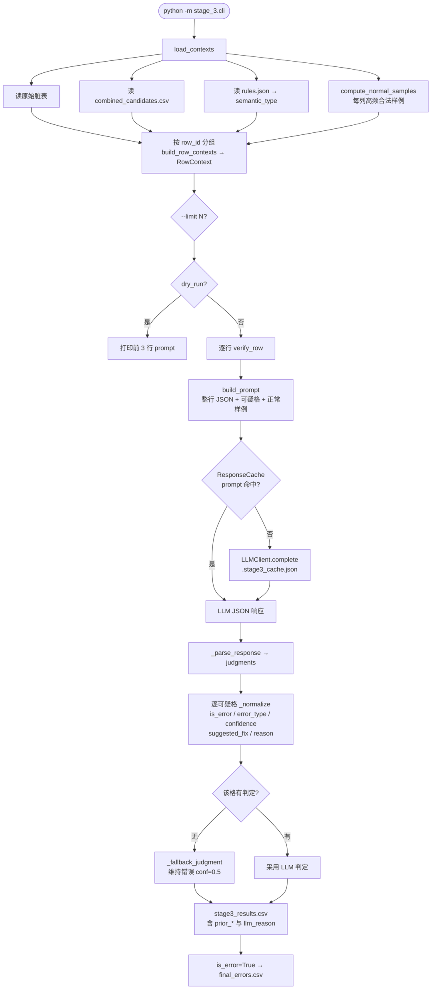
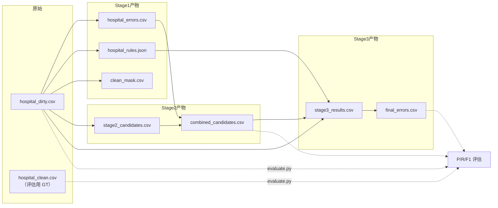
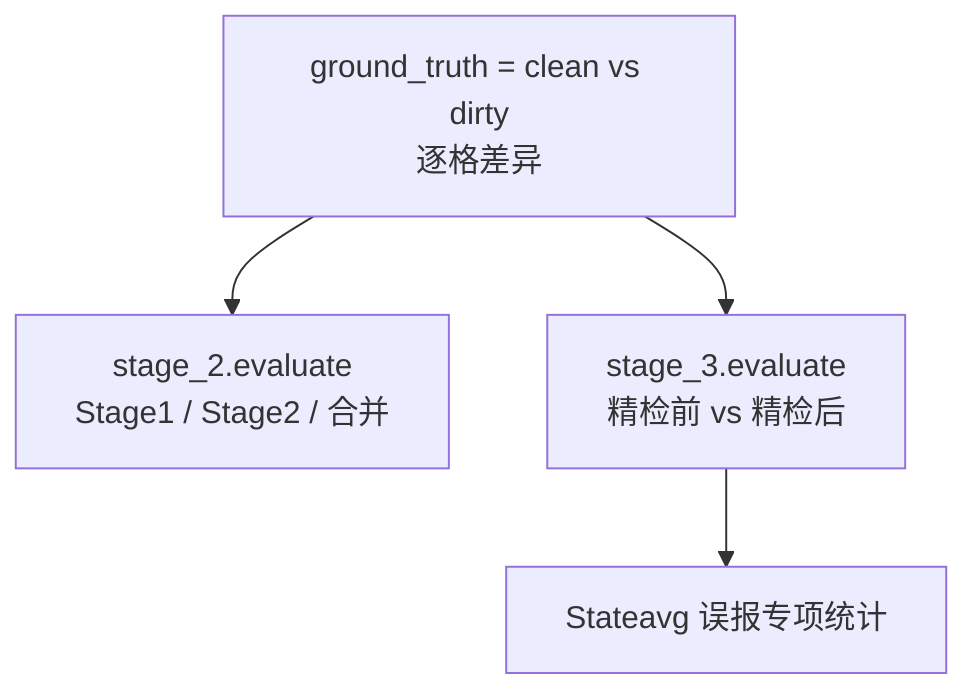
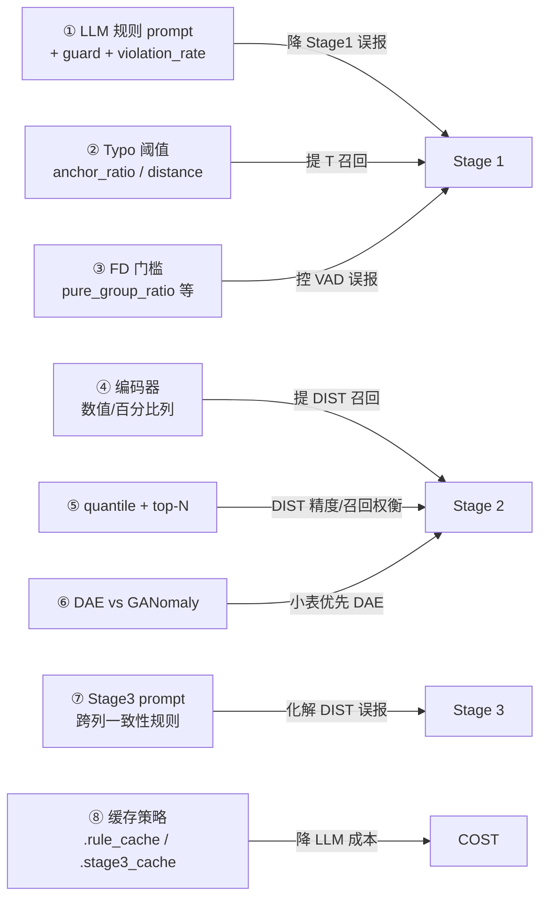

# 表格数据错误检测流水线 — 流程图与优化指南

本文档描述 Stage 1 / Stage 2 / Stage 3 三阶段表格错误检测的完整流程，便于后续召回、精度、成本与阈值优化。

**典型运行顺序：**

```bash
# 1. Stage 1
python main.py --input data/hospital_dirty.csv \
  --output data/hospital_errors.csv \
  --rules-out data/hospital_rules.json

# 2. Stage 2（依赖 clean_mask）
python -m stage_2.cli            # 默认 mode=fuse（DAE 单元格级 + GANomaly 行级）

# 3. Stage 3（依赖 combined_candidates）
python -m stage_3.cli

# 评估
python -m stage_2.evaluate
python -m stage_3.evaluate
```

---

## 各 Stage 作用详解

本流水线采用**三层漏斗**设计：先用高置信、可解释的规则快速筛出大部分明确错误；再用分布模型补规则层漏掉的软异常；最后用 LLM 结合整行上下文做确认、分类与修复建议。三层各司其职，逐级放宽检测条件、逐级收紧最终输出。



---

### Stage 1 — 规则层（高精度、可解释）

**定位：** 流水线的第一道关卡，负责检出**能用明确规则或统计方法描述**的错误。特点是精度高、可解释、成本低（规则可缓存），是后续 Stage 2/3 的基础。

**核心职责：**

| 职责 | 说明 |
|------|------|
| 逐列规则检测 | 借助 LLM 从列画像归纳 regex / 长度 / 数值范围 / 取值集合等规则，逐格校验 |
| 缺失值扫描 | 独立检测 MV，不依赖 LLM |
| 拼写错误检测 | 基于频次 + 编辑距离，发现低频值与高频锚点的近似拼写（T） |
| 跨列依赖挖掘 | 近似函数依赖（FD）挖掘，发现如 ZipCode → City 的强依赖违反（VAD） |
| 产出干净掩码 | 生成 `clean_mask.csv`，标记哪些单元格未被 Stage 1 检出，供 Stage 2 训练使用 |
| 产出列语义类型 | 生成 `hospital_rules.json`，含每列 `semantic_type`，供 Stage 3 构造 prompt |

**能检出的错误类型：**

| 类型 | 含义 | 典型场景 |
|------|------|---------|
| **MV** | 缺失值 | 空串、`empty`、NaN 等哨兵出现在不可空列 |
| **FI** | 格式 / 长度 / 范围 / 取值集合 | 电话格式错误、ZIP 非 5 位、数值超范围、非法枚举 |
| **T** | 拼写错误 | `birmingham` 写成 `birminghm`，低频 typo 相对高频锚点 |
| **VAD** | 跨列依赖违反 | ZipCode 与 City 不匹配、MeasureCode 与 Condition 不一致 |

**擅长与不擅长：**

- **擅长：** 格式明确、可写成规则的错误；强跨列依赖；高频拼写 typo；缺失值。hospital 上精度约 0.97，召回约 0.85。
- **不擅长：** 软统计型跨列异常（达不到 FD 阈值但联合分布异常）；数值离群但仍在合法范围内；难以写成规则的语义错误；Stage 1 漏报的列（如部分 `MeasureName`、`HospitalType` typo）。

**输入 / 输出：**

| 方向 | 文件 | 说明 |
|------|------|------|
| 输入 | `data/hospital_dirty.csv` | 待检测脏表 |
| 输入 | `configs/default.yaml`、`.env` | LLM 与规则执行参数 |
| 输出 | `data/hospital_errors.csv` | 检出的错误单元格及类型、原因 |
| 输出 | `data/hospital_rules.json` | 归纳规则与列语义类型 |
| 输出 | `clean_mask.csv` | 布尔掩码，True=干净（Stage 2 必需） |

**关键机制：** `flagged_cells` 去重贯穿全流程；规则违反率超 30% 自动丢弃；LLM 规则按列画像 MD5 缓存至 `.rule_cache.json`。

---

### Stage 2 — 分布异常层（补软异常、无监督）

**定位：** 流水线的第二道关卡，在 Stage 1 已标记的「干净子集」上学习**正确数据的联合分布**，对全量数据打分，检出规则层漏掉的**分布异常**（DIST）。完全无监督，不依赖 ground truth 标签。

**核心职责：**

| 职责 | 说明 |
|------|------|
| 表格编码 | 将混合类型表格转为数值张量，保留列→切片映射，支持误差还原到单元格 |
| 分布建模 | 在整行干净的样本上训练 DAE / GANomaly，学习正常联合分布 |
| 异常打分 | 对全量行（含脏行）计算重构误差或隐空间偏差，还原为逐列贡献 |
| 候选筛选 | 按列鲁棒归一化 + 分位阈值 + 每行 top-N，筛出可疑单元格 |
| 双模型融合 | DAE 负责单元格级，GANomaly 负责行级/多列联合，融合后送 Stage 3 |
| 与 Stage 1 合并 | 按 `(row_id, column)` 去重，Stage 1 优先，产出 `combined_candidates.csv` |

**双模型角色分工：**

| 模型 | 角色 | 检测逻辑 | 适用场景 |
|------|------|---------|---------|
| **DAE** | 单元格级定位专家 | 去噪自编码器：按列遮蔽训练，推断时重构误差大的格为异常；混合头（数值线性 / 类别 softmax / UNK·null sigmoid） | 类别脏值、未知枚举、缺失、拼写 typo、数值离群；**小表主力** |
| **GANomaly** | 行级 / 多列联合专家 | 重构式 GAN + feature-matching：隐空间偏差 + 判别器特征偏差作为行级异常分，行内 top-k 列粗定位 | 多列联合分布异常、行级整体不合理；**大表 / 连续特征场景主力**，小表上从严控误报 |

**编码层要点（决定 Stage 2 能否检出）：**

- 类别列：`one-hot` + `__UNK__`（未知/脏值点亮，产生明显重构误差）+ 频率特征 + `is_null`
- 数值列：单位感知解析（`97%`、`33 patients`）+ median/IQR 归一化 + `is_null`
- 高基数文本：surrogate 特征（长度、字符比例、频次、是否在干净集、n-gram hash），不再直接丢弃
- ID 列（ProviderNumber / ZipCode / PhoneNumber）：不当数值量纲，走类别/UNK 通道

**擅长与不擅长：**

- **擅长：** Stage 1 漏掉的类别 typo（如 `HospitalType`）；未知枚举/非法取值；数值离群；编码修复后 DIST 召回从约 0.14 提升至约 0.47（同等精度）。
- **不擅长：** 弱可预测列（如 `Sample` 计数）；需强跨列语义一致性的列（如 `CountyName` 与 City）；Stage 2 单独精度低于 Stage 1，误报需交 Stage 3 过滤。

**输入 / 输出：**

| 方向 | 文件 | 说明 |
|------|------|------|
| 输入 | `data/hospital_dirty.csv` | 待检测脏表 |
| 输入 | `clean_mask.csv` | Stage 1 干净掩码（训练必需） |
| 输入 | `data/hospital_errors.csv` | 用于合并去重 |
| 输出 | `data/stage2_candidates.csv` | 融合后的 DIST 候选（含 `subtype`: cell/row） |
| 输出 | `data/stage2_dae.csv`、`data/stage2_ganomaly.csv` | 两模型单独候选（调试/评估） |
| 输出 | `data/combined_candidates.csv` | Stage1 ∪ Stage2 合并（**Stage 3 输入**） |

**关键参数：** `quantile`（DAE 逐列阈值）、`max_cells_per_row`（抑制误差涂抹）、`row_quantile` / `row_top_k`（GANomaly 行级通道）。

---

### Stage 3 — LLM 精检层（确认、分类、修复）

**定位：** 流水线的最后一道关卡，对 Stage 1 + Stage 2 合并后的**可疑单元格候选**做语义级精检。利用 LLM 理解整行上下文、列语义类型与同列正常样例，完成**确认是否为真错误、修正错误类型、给出修复建议、否决误报**。

**核心职责：**

| 职责 | 说明 |
|------|------|
| 上下文构造 | 按 `row_id` 分组，组装整行值 + 可疑格 + 列语义类型 + 同列正常高频样例 |
| LLM 精检 | 一次 LLM 调用处理一行内多个可疑格，输出 JSON 判定 |
| 误报过滤 | 将前序 DIST 误报（如 `Stateavg` 派生列）判为 `NONE`，不再进入最终结果 |
| 类型细化 | 将笼统的 `DIST` 细分为 VAD / FI / OTHER 等，或维持 MV/FI/T/VAD |
| 修复建议 | 输出 `suggested_fix`，供人工或下游系统使用 |
| 响应缓存 | `.stage3_cache.json` 缓存相同 prompt 的 LLM 响应，降低成本 |

**错误类型映射：**

| 前序类型 | LLM 可输出的最终类型 | 说明 |
|---------|---------------------|------|
| MV / FI / T / VAD | 维持或修正 | Stage 1 高置信结果，LLM 可确认或纠正 |
| DIST | VAD / FI / OTHER / **NONE** | 分布层候选，LLM 结合跨列语义判断真伪 |
| NONE | — | 误报否决，不进入 `final_errors.csv` |

**擅长与不擅长：**

- **擅长：** 化解 Stage 2 的分布误报（跨列一致性、派生列语义）；对模糊候选给出可解释的 `llm_reason` 与 `suggested_fix`；提升合并候选集的最终精度。
- **不擅长：** 完全未被前序阶段召回的错误（无法精检未候选的格）；依赖 LLM API 成本与稳定性；解析失败时保守兜底（维持前序错误，confidence=0.5）。

**输入 / 输出：**

| 方向 | 文件 | 说明 |
|------|------|------|
| 输入 | `data/hospital_dirty.csv` | 原始脏表（取整行上下文） |
| 输入 | `data/combined_candidates.csv` | Stage1 ∪ Stage2 可疑候选 |
| 输入 | `data/hospital_rules.json` | 列 `semantic_type` |
| 输入 | `.env` | LLM API 配置 |
| 输出 | `data/stage3_results.csv` | 逐格判定明细（含 `is_error`、`confidence`、`llm_reason`） |
| 输出 | `data/final_errors.csv` | **最终确认错误**（`is_error=True` 的格） |

**建议用法：** 先 `--dry-run --limit 3` 确认 prompt，再全量运行；可用 `--limit N` 小规模试跑以控制成本。

---

### 三阶段协作关系小结

| 维度 | Stage 1 | Stage 2 | Stage 3 |
|------|---------|---------|---------|
| 检测范式 | 规则 + 统计 | 无监督分布建模 | LLM 语义推理 |
| 主要目标 | 高精度召回明确错误 | 补规则层盲点 | 确认、分类、过滤误报 |
| 错误类型 | MV / FI / T / VAD | DIST | 维持前序或细化为 VAD/FI/OTHER/NONE |
| 可解释性 | 高（规则、reason） | 中（重构误差、列贡献） | 高（llm_reason、suggested_fix） |
| 成本 | LLM 规则归纳（可缓存） | CPU 训练（无 LLM） | LLM 按行精检（可缓存） |
| 精度倾向 | 高 P，R ~85% | 中等 P，补召回 | 提升最终 P，输出可交付结果 |

**数据依赖链：** Stage 1 必须先跑（产出 `clean_mask`）→ Stage 2 依赖 Stage 1 → Stage 3 依赖 Stage 2 的 `combined_candidates` 与 Stage 1 的 `rules.json`。评估脚本 `stage_2.evaluate` / `stage_3.evaluate` 需 `hospital_clean.csv` 作为 ground truth，不参与正式检测流程。

---

## 一、整体架构（三层漏斗）



**设计思想：**

- **Stage 1**：硬规则 + 统计跨列，高精度、可解释（MV / FI / T / VAD）
- **Stage 2**：在干净子集上学分布，补规则层漏掉的软异常（DIST）
- **Stage 3**：LLM 结合整行上下文做最终确认，化解误报并输出 `suggested_fix`

---

## 二、Stage 1 详细流程

入口：`python main.py` 或 `stage_1.cli` → `run_rule_layer()`（`stage_1/executor.py`）



### Stage 1 错误类型与模块对应

| 错误类型 | 含义 | 检测模块 | 特点 |
|---------|------|---------|------|
| **MV** | 缺失值 | `scan_missing_value`（独立，不依赖 LLM） | 空串 / NaN / empty 等哨兵 |
| **FI** | 格式 / 长度 / 范围 | LLM 规则 + `RuleCompiler` | regex, length, numeric_range, value_set |
| **T** | 拼写错误 | `detect_typos` | 低频值 vs 高频锚点，编辑距离 |
| **VAD** | 跨列依赖违反 | `detect_vad` | 近似 FD 挖掘，如 ZipCode → City |

### Stage 1 关键模块

| 文件 | 职责 |
|------|------|
| `profiling.py` | 列画像（统计，不调 LLM） |
| `llm_rules.py` | LLM 规则归纳 + `LLMClient` |
| `rule_cache.py` | 画像 MD5 → 规则缓存（`.rule_cache.json`） |
| `rule_guard.py` | 自由文本列丢弃过严 regex |
| `rule_compiler.py` | JSON 规则 → 可执行校验函数 |
| `typo_detect.py` | 频次 + Levenshtein → T |
| `fd_detect.py` | 近似函数依赖挖掘 → VAD |

### Stage 1 去重机制

`flagged_cells: set[(row_id, column)]` 贯穿全流程：

- 规则层已标记的单元格，Typo / FD 不再重复报
- 每格规则执行时只报**第一条**违反规则

---

## 三、Stage 2 详细流程

入口：`python -m stage_2.cli` → `run_stage2()`（`stage_2/score.py`）



### Stage 2 设计要点

1. **训练数据净化**：只用 `clean_mask` 中整行干净的行训练，避免把错误学进分布
2. **推断覆盖全量**：打分时对全部行（含脏行）计算，以发现规则层漏报
3. **编码是主瓶颈**：`__UNK__`/单位数值/`is_null`/高基数 surrogate/ID 启发式使被丢弃或误编码的列重新可检
4. **角色分工**：DAE 单元格级（类别/缺失/拼写），GANomaly 行级/多列联合，融合后送 Stage 3
5. **按列鲁棒归一化**：逐列误差经干净集 MAD z-score 标准化，使每行 top-N 选择跨列可比
6. **召回/精度杠杆**：`quantile` / `max_cells_per_row`，FP 交 Stage 3 过滤

### Stage 2 关键模块

| 文件 | 职责 |
|------|------|
| `encoding.py` | 表格 → 数值张量（混合 role + 列切片），UNK/单位数值/surrogate/ID |
| `model.py` | DAE 单元格级 / GANomaly 行级（混合头、feature-matching、稳定化） |
| `score.py` | 按列鲁棒归一化、DAE/GANomaly 双通道、融合 `run_stage2` |
| `io_utils.py` | 表格/掩码读取、`merge_candidates` |

### Stage 2 实测结论（hospital 数据集）

| 层 | 检出 | P | R | F1 |
| --- | --- | --- | --- | --- |
| 旧版 Stage 2 DIST | 164 | 0.713 | 0.143 | 0.238 |
| **新版 Stage 2 DIST (fuse)** | 536 | **0.726** | **0.474** | **0.574** |
| Stage 1 规则层 | 719 | 0.972 | 0.852 | 0.908 |
| 合并 S1∪S2 | 885 | 0.811 | **0.876** | 0.842 |

- **编码修复带来主要增益**：DIST 召回 0.143 → 0.474（同等精度），DIST F1 ×2.4
- **DAE > GANomaly（小表）**：GANomaly 相对 DAE 独有真阳极少；架构已改造正确，定位大表场景

---

## 四、Stage 3 详细流程

入口：`python -m stage_3.cli` → `verify_contexts()`（`stage_3/verifier.py`）



### Stage 3 错误类型映射

| 前序类型 | LLM 最终类型 |
|---------|-------------|
| MV / FI / T / VAD | 可维持或修正 |
| DIST | 可细分为 VAD / FI / OTHER / **NONE** |
| NONE | 误报否决（如前序 Stateavg 类误报） |

解析失败时保守兜底：维持前序错误，`confidence=0.5`。

### Stage 3 关键模块

| 文件 | 职责 |
|------|------|
| `context.py` | 按行分组，构造 `RowContext` / `SuspectCell` |
| `prompt.py` | 渲染精检 prompt（整行 + 可疑格 + 正常样例） |
| `verifier.py` | 调用 LLM、解析 JSON、规范化判定 |
| `cache.py` | LLM 响应缓存（`.stage3_cache.json`） |
| `evaluate.py` | 精检前 vs 精检后 P/R/F1，Stateavg 误报专项 |

---

## 五、端到端数据流与文件产物



### 统一输出字段演进

| 阶段 | 核心字段 |
|------|---------|
| Stage 1 | `row_id, column, value, error_type, violated_rule, reason` |
| Stage 2 | 上述 + `anomaly_score, col_contribution`, `error_type=DIST` |
| 合并后 | 上述 + `source` (stage1 / stage2) |
| Stage 3 明细 | 上述 + `prior_*`, `is_error`, `confidence`, `suggested_fix`, `llm_reason` |
| 最终输出 | `row_id, column, error_type, confidence, suggested_fix` |

---

## 六、评估闭环



---

## 七、优化建议（按流程节点）



| 优化方向 | 涉及文件 / 配置 | 说明 |
|---------|----------------|------|
| 规则过严/过松 | `llm_rules.py`, `rule_guard.py`, `execution.max_violation_rate` | 平衡 Stage1 P/R |
| MV 可空推断 | `is_nullable_column`, `nullable_columns` | 减少 MV 误报 |
| Typo 召回 | `typo_detect.py`, `config typo.*` | 自由文本列拼写 |
| FD 精度 | `fd_detect.py`, `execution.fd.*` | 软相关 vs 真依赖 |
| 分布层编码 | `encoding.py` | 数值离群、联合异常 |
| DIST 阈值 | `score.py` `quantile`, `max_cells_per_row` | 合并 F1 关键杠杆 |
| LLM 精检成本 | `stage_3/cache.py`, `--limit` | 按行分组，一次 LLM 处理多格 |
| 精检质量 | `prompt.py` 跨列原则 | Stateavg 等派生列误报 |

---

## 八、代码入口速查

| 阶段 | CLI 入口 | 核心函数 |
|------|---------|---------|
| Stage 1 | `main.py` / `stage_1.cli` | `run_rule_layer()` |
| Stage 2 | `stage_2.cli` | `run_stage2()` |
| Stage 3 | `stage_3.cli` | `verify_contexts()` |

| 配置 | 路径 |
|------|------|
| Stage 1 | `configs/default.yaml` |
| Stage 2 | `stage_2/config.py`（代码默认 + CLI 覆盖） |
| Stage 3 | `stage_3/config.py`（代码默认 + CLI 覆盖） |
