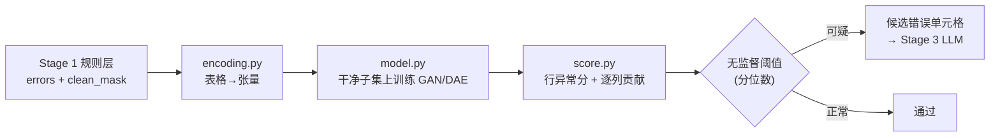
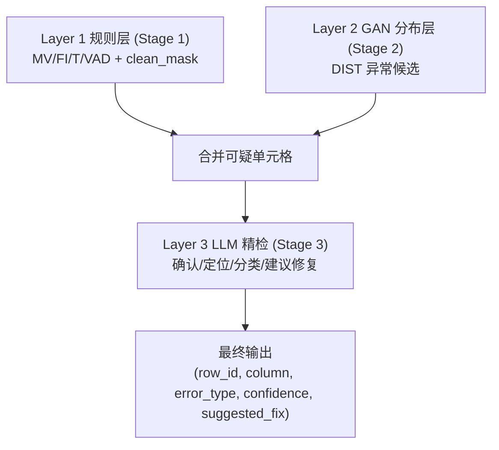

# Stage 2 设计文档：GAN 分布异常检测层（Layer 2）

## 1. 定位与目标

Stage 1（规则层）是**逐列 + 轻量跨列**的高精度检测，已能覆盖：

- MV（缺失值）、FI（格式/长度/范围/取值集合）
- T（基于频次 + 编辑距离的拼写错误候选）
- VAD（基于近似函数依赖的强跨列依赖违反）

但规则层对以下错误天然乏力，这正是 Stage 2 的目标：

- **软/统计型跨列依赖违反**：达不到函数依赖阈值、但联合分布上明显异常的组合。
- **数值离群与多变量异常**：单列范围内合法、但与其他列组合起来不合理。
- **难以写成规则的语义异常**：留给分布模型用"重构误差"间接捕获。

Stage 2 的产物是**带异常分的可疑单元格**，与 Stage 1 结果合并后送入 Stage 3（LLM 精检）。



## 2. 关键设计原则

### 2.1 训练数据先净化（最重要）

GAN/DAE 必须学习**正确数据**的分布。若直接在脏数据上训练，模型会把错误也当成正常，
异常分失效。因此：

- 读取 Stage 1 导出的 `clean_mask.csv`（True=干净单元格）。
- 训练集只保留**整行干净**的行（任一单元格被标记则该行不参与训练），或对脏单元格做掩码填充。
- 推断时对**全量行**打分（包括脏行），以发现规则层漏掉的错误。

### 2.2 逐列贡献（支持单元格定位）

总框架要求输出 `(row_id, column, error_type, confidence, suggested_fix)`，
因此必须把行级异常分**分摊到列**：

- 重构式模型天然支持 per-feature 重构误差：`行异常分 = Σ 列误差(加权)`。
- 输出每行 top-k 高误差列作为候选错误单元格。

### 2.3 无监督阈值

无标签场景下用**干净子集的异常分分布**定阈值：

- 在干净行上计算异常分，取高分位（如 99%）作为全局阈值；
- 或按列分别定阈值（每列误差分布的高分位），对列尺度差异更稳。

## 3. 数据编码（encoding.py）

每个特征维度带 role（numeric / binary / softmax），供模型施加混合输出头与按列损失；
编码器保存"列 → 张量切片"映射，供 score 阶段把误差**还原回原始列**。

| 列类型 | 编码方式 | 说明 |
| --- | --- | --- |
| 数值列（含 `97%` / `33 patients` 单位） | 单位感知解析 + median/IQR 归一化 + `is_null` 位 | 抗离群；含数字的地址不会误判为数值 |
| 低基数类别列 | one-hot + **`__UNK__`** + 频率特征 + `is_null` | 未知/脏值点亮 UNK（训练几乎不出现 → 明显误差）；低频值=潜在拼写 |
| 高基数文本列 | surrogate 特征（长度/字符比例/频次/是否在干净集/n-gram hash） | 不再直接丢弃，保留"形态/分布罕见"信号 |
| ID 列（整数高基数，如 ProviderNumber/ZipCode/PhoneNumber） | 走类别(UNK)/surrogate，**不当数值量纲** | 避免 `20018 vs 10018` 这类伪离群刷屏 |

关键修复（相对旧版）:
- **`__UNK__` 维**：旧版未知类别 → 全零 → 误差极小被当正常；新版点亮 UNK → 可检出。
- **单位/缺失感知**：旧版 `empty` 当类别值导致 `Score/Sample` 被当高基数丢弃；新版解析为数值。
- **ID 不当数值**：旧版 `ProviderNumber` 当数值刷屏误报；新版走类别/UNK。
- **按列鲁棒归一化**：逐列误差经干净集 median/MAD 标准化后再比较，消除宽列量纲偏置（影响每行 top-N 选择）。

## 4. 模型（model.py）— 角色分工

两者共享 encoding（混合头激活）与 score 接口。

### 4.1 DAE（单元格级定位专家）

- **混合输出头**：数值线性、类别 one-hot softmax、缺失/UNK sigmoid。
- **按"原始列"去噪**：整列遮蔽（置零或 swap-noise，他行同列值替换），
  替代旧版"按 bit 随机遮蔽"（one-hot 的有效 1 位极少被遮）。
- **按列损失**：类别段交叉熵 + 数值 MSE + 指示位 BCE，缓解稀疏 one-hot 的 MSE 偏置。
- 异常分：重构误差，逐列贡献天然支持单元格定位。**小表主力。**

### 4.2 GANomaly（行级 / 多列联合异常专家）

结构：`E1 -> G -> E2` + 判别器 D（返回 logits 与中间特征）。

- 损失：混合重构 + 隐一致 `||E1(x)-E2(G(x))||` + 对抗（label smoothing） +
  **feature-matching** `||mean f(x) - mean f(G(x))||`。
- **稳定化**：判别器 spectral norm；`w_recon` 由 50 降至 10（原值过高使其退化为 AE）。
- 异常分：隐空间偏差与判别器特征偏差的鲁棒标准化之和（行级）；逐列贡献用于粗定位。
- 实测在本小规模类别型表上独有贡献有限（见 §7），**定位为大表/连续特征场景主力**，
  小表融合时从严（top-1 列）以控误报。

### 4.3 融合（mode=fuse，默认）

DAE 产出 `subtype=cell` 候选，GANomaly 产出 `subtype=row` 候选，
按 `(row_id, column)` 融合（cell 优先），统一 `error_type=DIST` 送 Stage 3。

## 5. 打分与输出（score.py）

- 输入：训练好的模型 + 编码后的全量数据 + 编码映射。
- 计算每行异常分与逐列贡献，按阈值筛出可疑单元格。
- 输出 DataFrame：`row_id, column, value, error_type=DIST, anomaly_score, col_contribution`，
  其中 `error_type=DIST` 表示"分布异常候选"，最终类型由 Stage 3 判定。
- 与 Stage 1 `errors.csv` 合并去重（同一单元格保留信息更全者），形成 Stage 3 输入。

## 6. 与整体框架的衔接



## 7. 落地状态与实测（已实现）

已完成（PyTorch 2.x，CPU）:

1. `encoding.py`：单位感知数值 + 类别 one-hot/`__UNK__`/频率 + `is_null` + 高基数 surrogate
   + ID 启发式，混合 role 标注与列切片映射。
2. `model.py`：DAE（混合头/按列去噪 + swap-noise/按列损失）与 GANomaly（混合头/feature-matching/
   spectral norm/行级打分）。
3. `score.py`：按列鲁棒归一化 + DAE 单元格通道 + GANomaly 行级通道 + 融合（cell 优先）。
4. `cli.py` / `evaluate.py`：`--mode fuse|dae|ganomaly` 端到端；逐列召回 + 数值/类别分组 +
   DAE/GANomaly/融合三方对比评估。

### 运行
```
python -m stage_2.cli                          # 默认 mode=fuse（DAE+GANomaly）
python -m stage_2.cli --mode dae               # 仅单元格级
python -m stage_2.evaluate --by-column \
  --dae-candidates data/stage2_dae.csv \
  --ganomaly-candidates data/stage2_ganomaly.csv
```

### 实测（hospital，GT=820 注入错误单元格；默认 q=0.99, top-1/row, GANomaly top-1）

| 层 | 检出 | P | R | F1 | 说明 |
| --- | --- | --- | --- | --- | --- |
| 旧版 Stage 2 DIST (DAE) | 164 | 0.713 | 0.143 | 0.238 | 旧编码：未知类别全零 / 高基数丢弃 / ID 当数值 |
| **新版 Stage 2 DIST (fuse)** | 536 | **0.726** | **0.474** | **0.574** | 同等精度下召回 ×3 |
| &nbsp;&nbsp;└ DAE 单独 | 524 | 0.729 | 0.46+ | 0.57+ | 单元格级主力 |
| &nbsp;&nbsp;└ GANomaly 单独 | 53 | 0.623 | 0.040 | 0.076 | 小表独有贡献有限，从严控误报 |
| Stage 1 规则层 | 719 | 0.972 | 0.852 | 0.908 | MV/FI/T/VAD |
| 合并 S1∪S2 | 885 | 0.811 | **0.876** | 0.842 | 召回上限提升，FP 交 Stage 3 过滤 |

关键结论:
- **编码层是主瓶颈**：旧版仅 5 列以类别进入模型，`Score/Sample` 及高基数文本列被丢弃、
  ID 列误当数值。修复后 DIST 召回 0.143 → 0.474（同等精度），DIST F1 0.238 → 0.574。
- **Stage 1 盲点补回**：DAE 完整补回 `HospitalType`（21/21）、部分 `MeasureName`，
  Stage 1 漏报补回数 ~12 → ~24。
- **DAE > GANomaly（小表）**：GANomaly 相对 DAE 的独有真阳极少（uTP≈2-4），印证"纯 GAN
  在小规模类别型表上偏弱"。其架构已改造正确（混合头/feature-matching/稳定化），
  **定位为大表/连续特征场景主力**；小表融合时从严（top-1）以控误报。
- **召回/精度杠杆**：`quantile` 越低、`max_cells_per_row` 越大则召回越高、精度越低。
  默认 `q=0.99, top-1`（均衡）；偏召回可用 `q=0.98, max-cells-per-row=2`（合并 R≈0.89，FP 交 Stage 3）；
  偏精度可用 `q=0.995, top-1`。

### 后续可迭代
- `Sample`（弱可预测计数列）与 `CountyName`（与 City/ZipCode 的多列一致性）仍是盲点，
  前者难由分布模型定位，后者宜在更大数据上由 GANomaly 行级通道或 Stage 3 跨列规则化解。
- 大表上验证 GANomaly 行级通道（当前仅在 hospital 小表确认正确性与可对比性）。
