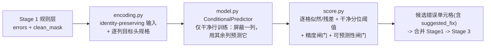
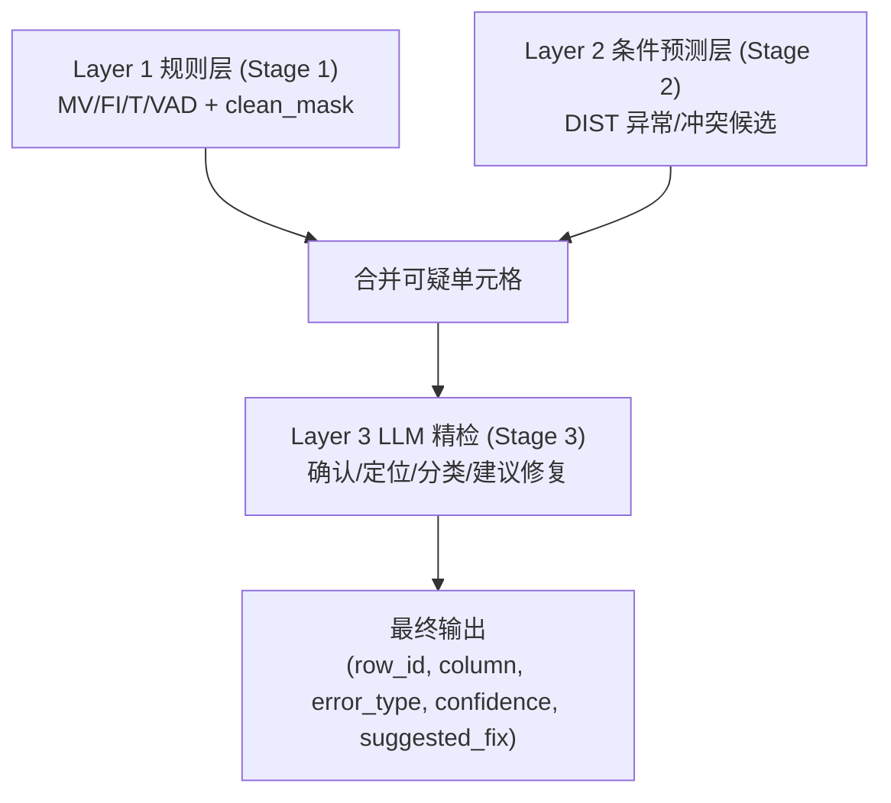

# Stage 2 设计文档：统一条件预测异常检测层（Layer 2）

## 1. 定位与目标

Stage 1（规则层）是**逐列 + 轻量跨列**的高精度检测，已能覆盖 MV / FI / T / VAD。
Stage 2 在 Stage 1 标记的「干净子集」上做**无监督**学习，补规则层漏掉的软异常，
完全不依赖 ground truth 标签。

**核心机制（一个通用模型，无需按数据集路由）：**

> 一个单元格是否为错误，取决于「它的取值能否由同一行的其余列预测出来」。

模型学习每一列的条件分布 `P(列 | 其余列)`。该单一机制同时统一了两类错误：

| 错误类型 | 例子 | 为什么条件预测能抓到 |
| --- | --- | --- |
| **分布型异常** | 拼写错误、未知类别、数值越界（hospital） | 行上下文给观测值低概率 / 大残差 |
| **键->值冲突 / 真值发现** | 某来源把航班时刻写错（flights） | `P(time \| flight)` 集中在该航班的共识取值，偏离者得到低概率 |

这避免了旧版「重构式分布模型（DAE/GANomaly）」的根本缺陷：旧版把高基数列
（`flight`=100、各时刻列=137~328）一律丢进 surrogate 哈希通道，键与取值的**身份被抹掉**，
模型只能看到 `surrogate(flight) -> surrogate(time)`，无法学到 `flight -> time`，于是
在 flights 上只会去标记「长度异常的格式」而漏掉真正的冲突，精度从 0.999 崩到 0.814。

## 2. 关键设计原则

### 2.1 训练数据先净化（最重要）

模型必须学习**正确数据**的条件分布。读取 Stage 1 的 `output/mask/{dataset}_clean_mask.csv`，训练集只用
**整行干净**的行，避免把错误学进分布；推断时对**全量行**打分以发现规则层漏报。

### 2.2 身份保留编码（identity-preserving）

类别基数上限 `max_cardinality` 提高到 500：键列（`flight`）与中等基数列（时刻）都以
**one-hot 身份**进入输入，并作为可预测的「类别目标」。仅超高基数自由文本列（> 上限，
如 `HospitalName`/`Address`）才走 surrogate 形态特征通道。这是让 `P(time|flight)` 可学的前提。

### 2.3 无监督阈值 + 召回地板 + 双闸门

- **逐列分位阈值**：在干净单元格的分数分布上取高分位（`quantile`，默认 0.99）。
- **绝对概率地板 `abs_prob_floor`（召回主杠杆）**：类别列只要 `P(观测值) < abs_prob_floor`
  （默认 0.02）即召回，与分位阈值取并集，不受分位数限制，直接抓「在上下文里本就极不可能」
  的低概率冲突取值。这是 flights 这类键->值冲突场景召回的关键（合并 R 0.554 -> 0.718）。
  偏召回可调大（如 0.05），偏精度设 0 关闭。
- **精度闸门 `margin`**：类别列仅当「模型更偏好的另一取值」概率超过观测值至少 `margin`
  才报，该 argmax 取值即 `suggested_fix`。
- **可预测性闸门 `min_predictability`**：类别列若在干净集上本就难以由其余列预测
  （如 `src` 这类标识列，top-1 准确率 < 0.5），其条件概率不可靠，整列跳过，避免刷误报。

## 3. 数据编码（encoding.py）

每列产出「输入块」与「目标头规格 `ColumnSpec`」两部分。

| 列类型 | 输入块布局 | 目标头(target_kind) |
| --- | --- | --- |
| 数值列（单位感知：`97%`/`33 patients`） | `[value(归一化), is_null]` | `numeric`（回归，标准化残差打分） |
| 低/中基数类别列（含键、时刻、ID） | `[one-hot(n_cat) \| __UNK__ \| freq \| is_null]` | `categorical`（softmax，NLL 打分） |
| 超高基数文本列（> max_cardinality） | `6 形态数值 + null + in_clean + n_hash 哈希` | `surrogate`（重构 6 个形态特征，MSE 打分） |

类数超过 `target_max_card` 的类别列仅作输入条件、不作预测目标（`target_kind=none`），
避免 softmax 类别爆炸。

## 4. 模型（model.py）— ConditionalPredictor

单一网络替代旧的 DAE + GANomaly：共享编码器（MLP）+ 逐列预测头。

- **masked-column 训练**：每个 batch 对每一列 `c`，把 `c` 的输入块置零（屏蔽自身），
  用其余列预测 `c` 的目标，累加各列损失（类别 CE / 数值 MSE / surrogate MSE）。
- **推理**：对每一列同样屏蔽自身后预测，得到该列在每行上的条件分布 / 预测值。
- 仅干净行训练，CPU 友好（千行级数据，120 epoch 约数十秒）。

## 5. 打分与输出（score.py）

- 类别：`score = -log P(观测值)`；数值：标准化残差；surrogate：形态重构 MSE。
- 逐列干净分位阈值 + 精度闸门 + 可预测性闸门筛出可疑单元格。
- 输出 `row_id, column, value, error_type=DIST, anomaly_score, col_contribution,
  suggested_fix, subtype`，与 Stage 1 `errors.csv` 合并去重（Stage1 优先）后送 Stage 3。

## 6. 与整体框架的衔接

## 7. 实测（已实现，PyTorch 2.x，CPU）

统一模型在两个差异很大的数据集上均表现良好（同一套默认参数，无数据集特判）：

| 数据集 | 层 | 检出 | P | R | F1 |
| --- | --- | --- | --- | --- | --- |
| **flights** | Stage 1 规则层 | 2673 | 0.999 | 0.542 | 0.703 |
|  | Stage 2 DIST | 264 | 0.871 | 0.047 | 0.089 |
|  | **合并 S1∪S2** | 2764 | **0.986** | **0.554** | **0.710** |
| **hospital** | Stage 1 规则层 | 749 | 0.961 | 0.878 | 0.918 |
|  | Stage 2 DIST | 570 | 0.686 | 0.477 | 0.563 |
|  | **合并 S1∪S2** | 904 | **0.802** | **0.884** | **0.841** |

关键结论：
- **flights**：旧 DAE/GANomaly 设计使合并精度从 0.999 崩到 0.814（F1 0.656）；统一模型把
  键->值冲突（如 `sched_dep_time` 召回 0.97）找回，合并精度回到 **0.986**，F1 **0.710** 反超
  Stage 1 单独。`act_*`（实际时刻）天然无强共识，召回偏低属预期。
- **hospital**：与旧设计基本持平（合并 F1 0.841 vs 0.842，召回略升），分布型错误检测能力未退化。
- DIST 的误报（如 `Stateavg` 派生列、`flight` 反向预测噪声）交由 Stage 3 LLM 过滤。

### 后续可迭代
- 来源可靠性加权的真值发现（Accu/TruthFinder 风格：迭代「来源可信度 × 取值支持度」），
  在多来源冲突场景进一步提精度。
- 对极宽表用 cell-level attention（Picket 风格）替代共享 MLP 编码器。
- 这些升级都不改变 Stage 2 对外接口（编码/模型/打分三段式）。
